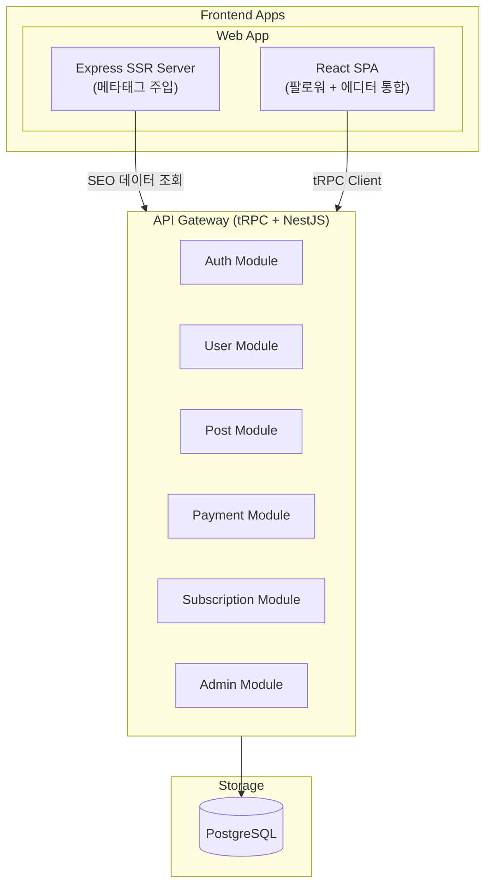
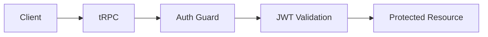
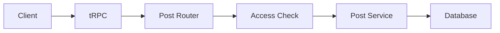

# 시스템 아키텍처

## 개요

Readly는 모노레포 구조의 풀스택 애플리케이션입니다. tRPC를 통한 타입 안전한 API와 NestJS의 강력한 백엔드 기능을 결합했습니다.

## 아키텍처 다이어그램



## 기술 스택

### Backend

- **Framework**: NestJS + tRPC
- **Database**: PostgreSQL
- **ORM**: TypeORM

### Frontend

- **Framework**: React 18
- **Build Tool**: Vite
- **SSR**: Partial SSR (Express + 메타태그 문자열 치환, React SSR 미사용)
- **Styling**: Tailwind CSS + tailwind-styled-components
- **State**: Zustand
- **Forms**: React Hook Form + Zod
- **Router**: TanStack Router

## 디렉토리 구조

```
readly/
├── apps/
│   ├── api/                 # Backend API
│   │   └── src/
│   │       ├── module/      # NestJS 모듈
│   │       └── shared/      # 공통 유틸리티
│   └── client/              # 팔로워 + 에디터 통합 웹앱 (단일 배포)
├── packages/
│   └── api-types/           # API 타입 정의
├── PM-DOCS/                 # PM 기획 문서
└── docker/                  # Docker 설정
```

> `apps/client`가 팔로워와 에디터 기능을 통합하여 단일 Web App으로 배포됩니다.

## 데이터 플로우

### 인증 플로우



### 포스트 조회 플로우



## 보안 아키텍처

- **인증**: JWT (Access Token + Refresh Token in Cookie)
- **인가**: Role-Based Access Control
- **API 보안**: Rate Limiting, CORS
- **암호화**: bcrypt (비밀번호)
