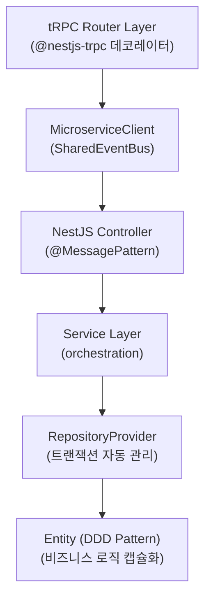

# 백엔드 아키텍처 상세

## Microservice + tRPC 하이브리드 패턴



## 디렉토리 구조

```
apps/api/src/
├── module/
│   ├── domain/              # Entity 정의
│   │   ├── user.entity.ts   # UserEntity + getUserRepository
│   │   └── post.entity.ts   # PostEntity + getPostRepository
│   ├── user/                # User 도메인
│   │   ├── user.service.ts
│   │   ├── user.router.ts
│   │   ├── user.controller.ts
│   │   └── user.auth.middleware.ts
│   ├── post/                # Post 도메인
│   │   ├── post.service.ts
│   │   ├── post.router.ts
│   │   └── post.controller.ts
│   ├── shared/              # 공유 모듈
│   │   ├── entity/          # BaseEntity
│   │   ├── transaction/     # TransactionService, RepositoryProvider
│   │   └── request/
│   └── trpc/                # tRPC 설정
│       ├── baseTrpcRouter.ts
│       ├── microserviceClient.ts
│       └── services/
│           └── cookie.service.ts
├── database/
│   ├── datasources.ts       # DataSource 싱글톤 관리
│   └── migration/           # 마이그레이션 파일
└── config.ts                # ConfigProvider
```

## Transaction 패턴

### TransactionService (REQUEST 스코프)

```typescript
// 자동 트랜잭션 관리
@Injectable({ scope: Scope.REQUEST })
export class TransactionService {
  private entityManager?: EntityManager;

  async startTransaction(): Promise<EntityManager>;
  async runInTransaction<T>(fn: (em: EntityManager) => Promise<T>): Promise<T>;
  getTransaction(): EntityManager | undefined;
  get isTransactionActive(): boolean;
}
```

### RepositoryProvider 사용

```typescript
// RepositoryProvider는 자동으로 현재 트랜잭션 사용
@Injectable({ scope: Scope.REQUEST })
export class RepositoryProvider {
  constructor(private transaction: TransactionService) {}

  get UserRepository() {
    return getUserRepository(this.transaction);
  }

  get PostRepository() {
    return getPostRepository(this.transaction);
  }
}
```

### getEntityManager 헬퍼

```typescript
// Entity 파일에서 Repository 정의 시 사용
export function getEntityManager(
  source?: TransactionService | EntityManager
): EntityManager | DataSource {
  if (!source) return DataSources.readly;
  if (source instanceof TransactionService) {
    return source.getTransaction() || DataSources.readly;
  }
  return source;
}
```

## MicroserviceClient 패턴

```typescript
// Router에서 Service 호출
@Mutation({ input: createPostSchema, output: postResponseSchema })
async create(@Input('title') title: string, @Ctx() ctx: any) {
  return await this.microserviceClient.send('post.create', {
    title,
    authorId: ctx.user.id,
  });
}

// MicroserviceClient 내부
export class MicroserviceClient {
  async send<T>(pattern: string, data: any): Promise<T> {
    return new Promise((resolve, reject) => {
      SharedEventBus.emit(pattern, data, (error, result) => {
        if (error) reject(new TRPCError({ ... }));
        else resolve(result);
      });
    });
  }
}
```

## ConfigProvider

```typescript
export const ConfigProvider = {
  stage: string,
  database: {
    readly: {
      type: 'postgres',
      host: string,
      roHost: string,  // 읽기 전용 복제본
      port: number,
      username: string,
      password: string,
      database: string,
    }
  },
  auth: {
    jwt: {
      user: {
        access: { secret, expiresIn },
        refresh: { secret, expiresIn },
      },
    }
  },
  cors: { origin, credentials }
};
```

## 모듈 추가 시 체크리스트

1. **Entity 생성** (`module/domain/`)
   - [ ] BaseEntity 상속
   - [ ] Factory Method 정의
   - [ ] 비즈니스 로직 메서드 정의
   - [ ] getXxxRepository 함수 정의

2. **RepositoryProvider에 추가** (`module/shared/transaction/`)
   - [ ] getter 추가

3. **Service 생성** (`module/{domain}/`)
   - [ ] RepositoryProvider 주입
   - [ ] orchestration 로직만 작성

4. **Router 생성** (`module/{domain}/`)
   - [ ] BaseTrpcRouter 상속
   - [ ] @Router, @Query, @Mutation 데코레이터
   - [ ] Zod 스키마 정의

5. **Controller 생성** (`module/{domain}/`)
   - [ ] @MessagePattern 데코레이터
   - [ ] Service 호출

6. **Module 등록**
   - [ ] {Domain}Module 생성
   - [ ] AppModule에 import
