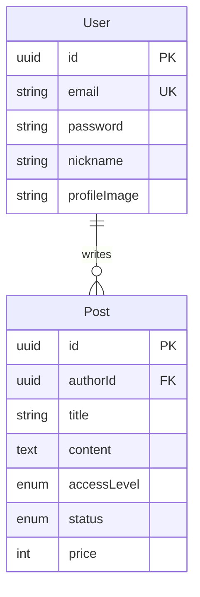

# Domain 문서 인덱스

## 문서 목록

| 문서                         | 설명                               |
| ---------------------------- | ---------------------------------- |
| [features.md](./features.md) | 기능 명세 (사용자 유형, 접근 권한) |
| [user.md](./user.md)         | User 도메인 (Entity, JWT 인증)     |
| [post.md](./post.md)         | Post 도메인 (Entity, 접근 권한)    |

## 도메인 개요

## 빠른 참조

### User 도메인

- **Entity**: `module/domain/user.entity.ts`
- **주요 메서드**: `setPassword()`, `checkPassword()`, `register()`
- **JWT**: Access 15분, Refresh 7일

### Post 도메인

- **Entity**: `module/domain/post.entity.ts`
- **접근 권한**: public, subscriber, purchaser, private
- **상태**: draft, published, scheduled
