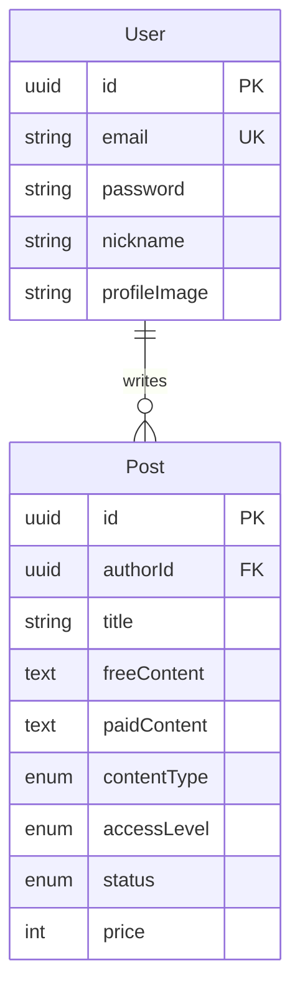

# Domain 문서 인덱스

## 문서 목록

| 문서                         | 설명                                             |
| ---------------------------- | ------------------------------------------------ |
| [overview.md](./overview.md) | 프로젝트 기획서 (비전, 사용자 유형, 서비스 구성) |
| [features.md](./features.md) | 기능 명세 (접근 권한, 유료/무료 섹션, 결제)      |
| [user.md](./user.md)         | User 도메인 (Entity, JWT 인증)                   |
| [post.md](./post.md)         | Post 도메인 (Entity, 유료/무료 섹션, 접근 권한)  |
| [seo.md](./seo.md)           | SEO 전략 (Partial SSR, 메타태그 서버 주입)       |

## 도메인 개요

## 빠른 참조

### User 도메인

- **Entity**: `module/domain/user.entity.ts`
- **주요 메서드**: `setPassword()`, `checkPassword()`, `register()`
- **JWT**: Access 15분, Refresh 7일

### Post 도메인

- **Entity**: `module/domain/post.entity.ts`
- **콘텐츠 필드**: `freeContent` (무료 구간), `paidContent` (유료 구간)
- **콘텐츠 타입**: text (현재), image / mixed (향후 확장)
- **접근 권한**: public, subscriber, purchaser, private
- **상태**: draft, published, scheduled
