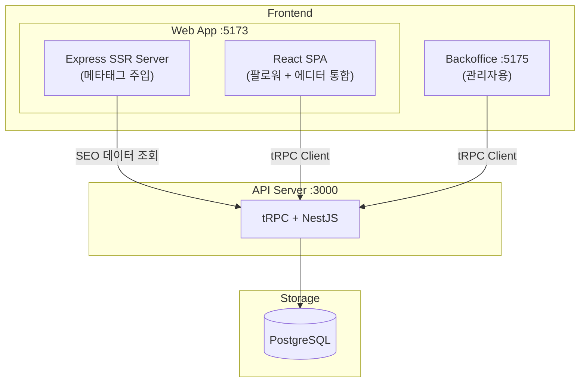
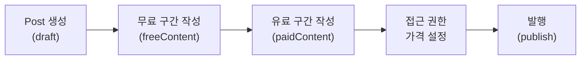
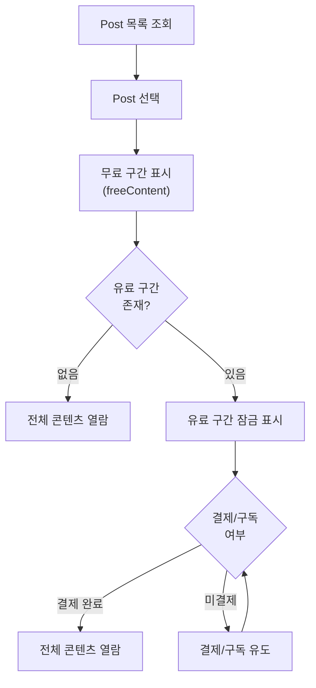
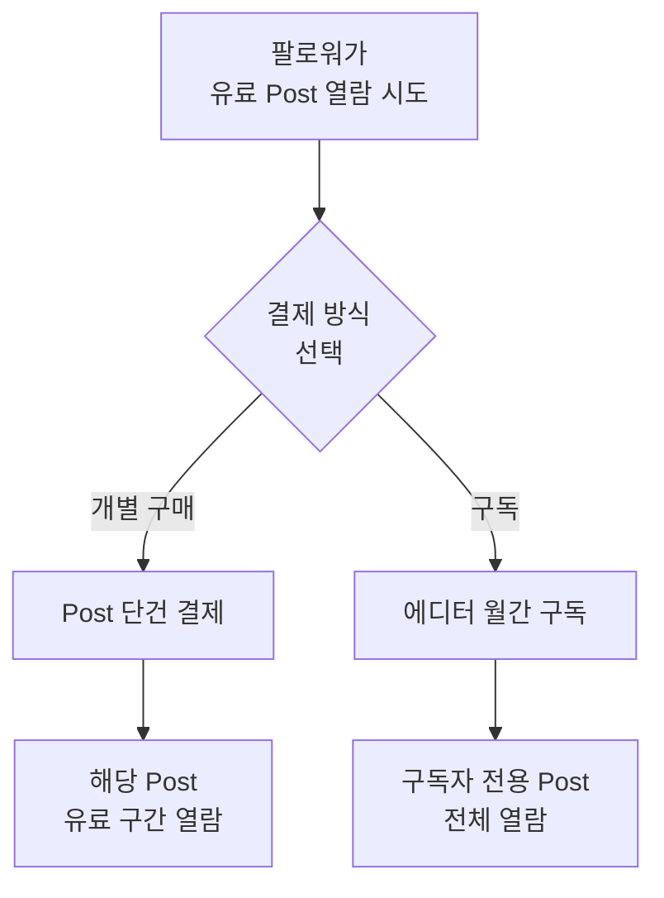

# Readly 프로젝트 기획서

## 비전

Readly는 에디터(창작자)와 팔로워(독자)를 연결하는 **유료 블로그 플랫폼**입니다.
Instagram처럼 사용자가 Post를 발행하고, 다른 사용자가 해당 Post를 결제하여 열람합니다.

## 핵심 가치

| 가치             | 설명                                              |
| ---------------- | ------------------------------------------------- |
| 창작자 수익화    | 에디터가 콘텐츠로 직접 수익을 창출                |
| 유연한 접근 제어 | Post별 무료/유료 구간 설정, 다양한 접근 권한      |
| 긴 글 중심       | 팬픽(Fan Fiction) 등 장문 콘텐츠에 최적화         |
| 확장 가능성      | 향후 웹툰(이미지) 등 다양한 콘텐츠 타입 지원 가능 |

## 사용자 유형

| 유형                  | 역할                                             | 접근 영역             |
| --------------------- | ------------------------------------------------ | --------------------- |
| **에디터** (Editor)   | 콘텐츠 생산자. Post 작성, 가격 설정, 구독자 관리 | Web App (에디터 영역) |
| **팔로워** (Follower) | 콘텐츠 소비자. Post 열람, 구매, 구독             | Web App (팔로워 영역) |
| **관리자** (Admin)    | 플랫폼 운영자. 회원/콘텐츠/결제 관리             | Backoffice App        |

## 서비스 구성

| 앱             | 대상            | 주요 기능                                               |
| -------------- | --------------- | ------------------------------------------------------- |
| **Web App**    | 팔로워 + 에디터 | Post 열람/검색/구매/구독 + Post 작성/발행/수익 대시보드 |
| **Backoffice** | 관리자          | 회원 관리, 콘텐츠 모더레이션, 결제/정산                 |
| **API**        | 전체            | tRPC + NestJS 백엔드, 인증, 결제 처리                   |

> Client(팔로워용)와 Editor(에디터용)는 **하나의 프론트엔드 앱으로 통합 배포**됩니다.
> Web App은 **Partial SSR** 방식으로 SEO 메타태그만 서버에서 주입하고, 본문은 클라이언트에서 렌더링합니다. (상세: `domain/seo.md`)

## 주요 Flow

### 1. Post 발행 Flow (에디터)

### 2. Post 열람 Flow (팔로워)

### 3. 결제 Flow

## 콘텐츠 타입

### 현재 지원

- **텍스트 (Long-form)**: 팬픽, 소설, 에세이 등 장문 콘텐츠

### 향후 확장 (현재 미구현)

- **이미지 (웹툰)**: 이미지 기반 콘텐츠 (웹툰, 일러스트)
- **혼합형**: 텍스트 + 이미지 결합

> 현재는 텍스트 중심으로 구현하되, 콘텐츠 타입 필드(`contentType`)를 통해 향후 확장 가능한 구조로 설계합니다.

## 관련 문서

| 문서                    | 설명                                   |
| ----------------------- | -------------------------------------- |
| `domain/features.md`    | 기능 명세 상세                         |
| `domain/post.md`        | Post 도메인 모델 (유료/무료 섹션 포함) |
| `domain/user.md`        | User 도메인 모델                       |
| `domain/seo.md`         | SEO 전략 (Partial SSR)                 |
| `architecture/INDEX.md` | 시스템 아키텍처                        |
