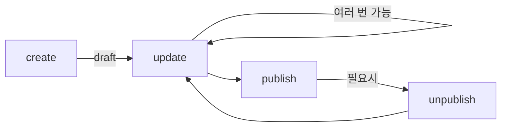

# Post 도메인

## PostEntity

```typescript
@Entity('posts')
export class PostEntity extends BaseEntity {
  @Column({ type: 'uuid' })
  authorId: string;

  @Column({ type: 'varchar', length: 200 })
  title: string;

  @Column({ type: 'text' })
  freeContent: string; // 무료 공개 구간

  @Column({ nullable: true, type: 'text' })
  paidContent: string | null; // 유료 구간 (결제/구독 후 열람)

  @Column({ nullable: true, type: 'text' })
  excerpt: string | null;

  @Column({ nullable: true, type: 'varchar' })
  thumbnail: string | null;

  @Column({
    type: 'enum',
    enum: ['text', 'image', 'mixed'],
    default: 'text',
  })
  contentType: 'text' | 'image' | 'mixed'; // 향후 확장용

  @Column({
    type: 'enum',
    enum: ['public', 'subscriber', 'purchaser', 'private'],
    default: 'public',
  })
  accessLevel: 'public' | 'subscriber' | 'purchaser' | 'private';

  @Column({
    type: 'enum',
    enum: ['draft', 'published', 'scheduled'],
    default: 'draft',
  })
  status: 'draft' | 'published' | 'scheduled';

  @Column({ type: 'int', default: 0 })
  price: number;

  @Column({ nullable: true, type: 'timestamp' })
  publishedAt: Date | null;

  @DeleteDateColumn()
  deletedAt: Date | null;

  @ManyToOne(() => UserEntity)
  @JoinColumn({ name: 'author_id' })
  author: UserEntity;
}
```

## 유료/무료 섹션 구분

### 설계 원칙

하나의 Post는 **무료 구간(freeContent)**과 **유료 구간(paidContent)** 두 개의 필드로 나뉩니다.

| 필드          | 용도                      | 노출 조건         |
| ------------- | ------------------------- | ----------------- |
| `freeContent` | 무료 공개 부분 (미리보기) | 항상 노출         |
| `paidContent` | 유료 부분 (본문)          | 결제/구독 후 노출 |

### 접근 시나리오

| accessLevel  | freeContent | paidContent   |
| ------------ | ----------- | ------------- |
| `public`     | 모두 열람   | 모두 열람     |
| `subscriber` | 모두 열람   | 구독자만 열람 |
| `purchaser`  | 모두 열람   | 구매자만 열람 |
| `private`    | 작성자만    | 작성자만      |

### 필드 분리 방식 선택 이유

- **보안**: 서버에서 유료 콘텐츠 자체를 미전송 (마커 방식은 프론트에서 숨기는 것에 불과)
- **단순성**: 프론트엔드에서 조건부 렌더링 로직이 간단
- **확장성**: 향후 유료 구간별 가격 차등 등 확장 용이

## 콘텐츠 타입 (향후 확장)

| contentType | 설명                          | 현재 상태            |
| ----------- | ----------------------------- | -------------------- |
| `text`      | 텍스트 기반 장문 (팬픽, 소설) | **구현 중**          |
| `image`     | 이미지 기반 (웹툰, 일러스트)  | 미구현 (필드만 예약) |
| `mixed`     | 텍스트 + 이미지 혼합          | 미구현 (필드만 예약) |

> 현재는 `text` 타입만 구현합니다. `contentType` 필드는 향후 확장을 위해 Entity에 포함합니다.

## 접근 권한 시스템

| accessLevel  | 설명        | 접근 가능                   |
| ------------ | ----------- | --------------------------- |
| `public`     | 전체공개    | 모든 사용자 (비로그인 포함) |
| `subscriber` | 구독자 전용 | 작성자 + 구독자             |
| `purchaser`  | 구매자 전용 | 작성자 + 구매자             |
| `private`    | 비공개      | 작성자만                    |

## 비즈니스 로직

### Factory Method

```typescript
static create(input: {
  authorId: string;
  title: string;
  freeContent: string;
  paidContent?: string;
  excerpt?: string;
  thumbnail?: string;
  contentType?: ContentType;
  accessLevel?: AccessLevel;
  price?: number;
}): PostEntity {
  const post = new PostEntity();
  post.authorId = input.authorId;
  post.title = input.title;
  post.freeContent = input.freeContent;
  post.paidContent = input.paidContent ?? null;
  post.excerpt = input.excerpt ?? null;
  post.thumbnail = input.thumbnail ?? null;
  post.contentType = input.contentType ?? 'text';
  post.accessLevel = input.accessLevel ?? 'public';
  post.price = input.price ?? 0;
  post.status = 'draft';
  return post;
}
```

### 발행/취소

```typescript
publish(): void {
  if (this.status === 'published') {
    throw new Error('Post is already published');
  }
  this.status = 'published';
  this.publishedAt = new Date();
}

unpublish(): void {
  if (this.status !== 'published') {
    throw new Error('Post is not published');
  }
  this.status = 'draft';
  this.publishedAt = null;
}
```

### 권한 검증

```typescript
// 수정 권한
canBeEditedBy(authorId: string): boolean {
  return this.authorId === authorId;
}

// 읽기 권한 (freeContent 접근)
canBeReadBy(user: UserEntity | null): boolean {
  if (user?.id === this.authorId) return true;
  if (this.status !== 'published') return false;
  if (this.accessLevel === 'private') return false;
  return true; // freeContent는 public/subscriber/purchaser 모두 열람 가능
}

// 유료 콘텐츠 접근 권한
canAccessPaidContent(user: UserEntity | null): boolean {
  if (user?.id === this.authorId) return true;
  if (this.status !== 'published') return false;
  if (this.accessLevel === 'public') return true; // 전체공개는 유료 구간도 공개
  if (this.accessLevel === 'private') return false;
  // subscriber, purchaser는 추가 검증 필요 (구독/구매 여부 확인)
  return false;
}
```

## Repository 확장

```typescript
export const getPostRepository = (source?) =>
  getEntityManager(source)
    .getRepository(PostEntity)
    .extend({
      async createPost(input): Promise<PostEntity> {
        const post = PostEntity.create(input);
        return this.save(post);
      },

      async findByAuthor(authorId: string): Promise<PostEntity[]> {
        return this.find({
          where: { authorId },
          order: { createdAt: 'DESC' },
          relations: ['author'],
        });
      },

      async findPublished(): Promise<PostEntity[]> {
        return this.find({
          where: { status: 'published', accessLevel: 'public' },
          order: { publishedAt: 'DESC' },
          relations: ['author'],
        });
      },

      async findOneByIdForEdit(postId, authorId): Promise<PostEntity> {
        const post = await this.findOneOrFail({
          where: { id: postId },
          relations: ['author'],
        }).catch(() => {
          throw new Error('Post not found');
        });

        if (!post.canBeEditedBy(authorId)) {
          throw new Error('You are not allowed to edit this post');
        }

        return post;
      },

      async findOneByIdForRead(postId, userId?): Promise<PostEntity> {
        const post = await this.findOneOrFail({
          where: { id: postId },
          relations: ['author'],
        }).catch(() => {
          throw new Error('Post not found');
        });

        const user = userId
          ? await getUserRepository(source).findOneBy({ id: userId })
          : null;

        if (!post.canBeReadBy(user)) {
          throw new Error('You are not allowed to read this post');
        }

        return post;
      },
    });
```

## PostRouter (tRPC)

### Mutations (인증 필요)

| 엔드포인트       | 설명                |
| ---------------- | ------------------- |
| `post.create`    | 포스트 생성 (draft) |
| `post.update`    | 포스트 수정         |
| `post.publish`   | 포스트 발행         |
| `post.unpublish` | 포스트 발행 취소    |
| `post.delete`    | 포스트 삭제         |

### Queries

| 엔드포인트           | 설명             | 인증               |
| -------------------- | ---------------- | ------------------ |
| `post.getOne`        | 포스트 조회      | 불필요 (권한 체크) |
| `post.getMy`         | 내 포스트 목록   | 필요               |
| `post.getAccessible` | 접근 가능 포스트 | 불필요             |

### 응답 시 유료 콘텐츠 제어

```typescript
// post.getOne 응답 시 paidContent 포함 여부 결정
const response = {
  ...post,
  paidContent: post.canAccessPaidContent(user) ? post.paidContent : null,
  isPaidContentLocked:
    !post.canAccessPaidContent(user) && post.paidContent !== null,
};
```

## 포스트 작성 흐름



## 프론트엔드 폼 스키마

```typescript
const createPostSchema = z.object({
  title: z.string().min(1, '제목을 입력해주세요').max(200),
  freeContent: z.string().min(1, '무료 공개 내용을 입력해주세요'),
  paidContent: z.string().optional(),
  contentType: z.enum(['text', 'image', 'mixed']).default('text'),
  accessLevel: z.enum(['public', 'subscriber', 'purchaser', 'private']),
  price: z.number().min(0).optional(),
  excerpt: z.string().max(500).optional(),
  thumbnail: z.string().url().optional(),
});
```
