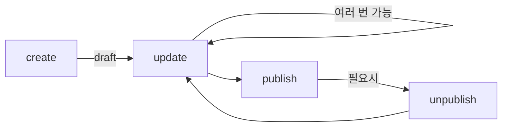

# Post 도메인

## PostEntity

```typescript
@Entity('posts')
export class PostEntity extends BaseEntity {
  @Column({ type: 'uuid' })
  authorId: string;

  @Column({ type: 'varchar', length: 200 })
  title: string;

  @Column({ type: 'text' })
  content: string;

  @Column({ nullable: true, type: 'text' })
  excerpt: string | null;

  @Column({ nullable: true, type: 'varchar' })
  thumbnail: string | null;

  @Column({
    type: 'enum',
    enum: ['public', 'subscriber', 'purchaser', 'private'],
    default: 'public',
  })
  accessLevel: 'public' | 'subscriber' | 'purchaser' | 'private';

  @Column({
    type: 'enum',
    enum: ['draft', 'published', 'scheduled'],
    default: 'draft',
  })
  status: 'draft' | 'published' | 'scheduled';

  @Column({ type: 'int', default: 0 })
  price: number;

  @Column({ nullable: true, type: 'timestamp' })
  publishedAt: Date | null;

  @DeleteDateColumn()
  deletedAt: Date | null;

  @ManyToOne(() => UserEntity)
  @JoinColumn({ name: 'author_id' })
  author: UserEntity;
}
```

## 접근 권한 시스템

| accessLevel  | 설명        | 접근 가능                   |
| ------------ | ----------- | --------------------------- |
| `public`     | 전체공개    | 모든 사용자 (비로그인 포함) |
| `subscriber` | 구독자 전용 | 작성자 + 구독자             |
| `purchaser`  | 구매자 전용 | 작성자 + 구매자             |
| `private`    | 비공개      | 작성자만                    |

## 비즈니스 로직

### Factory Method

```typescript
static create(input: {
  authorId: string;
  title: string;
  content: string;
  excerpt?: string;
  thumbnail?: string;
  accessLevel?: AccessLevel;
  price?: number;
}): PostEntity {
  const post = new PostEntity();
  post.authorId = input.authorId;
  post.title = input.title;
  post.content = input.content;
  post.excerpt = input.excerpt ?? null;
  post.thumbnail = input.thumbnail ?? null;
  post.accessLevel = input.accessLevel ?? 'public';
  post.price = input.price ?? 0;
  post.status = 'draft';
  return post;
}
```

### 발행/취소

```typescript
publish(): void {
  if (this.status === 'published') {
    throw new Error('Post is already published');
  }
  this.status = 'published';
  this.publishedAt = new Date();
}

unpublish(): void {
  if (this.status !== 'published') {
    throw new Error('Post is not published');
  }
  this.status = 'draft';
  this.publishedAt = null;
}
```

### 권한 검증

```typescript
// 수정 권한
canBeEditedBy(authorId: string): boolean {
  return this.authorId === authorId;
}

// 읽기 권한
canBeReadBy(user: UserEntity | null): boolean {
  // 작성자는 항상 접근 가능
  if (user?.id === this.authorId) return true;

  // 미발행 포스트는 작성자만
  if (this.status !== 'published') return false;

  // 비공개는 작성자만
  if (this.accessLevel === 'private') return false;

  // 전체공개는 누구나
  if (this.accessLevel === 'public') return true;

  // subscriber, purchaser는 추가 검증 필요
  return false;
}
```

## Repository 확장

```typescript
export const getPostRepository = (source?) =>
  getEntityManager(source)
    .getRepository(PostEntity)
    .extend({
      async createPost(input): Promise<PostEntity> {
        const post = PostEntity.create(input);
        return this.save(post);
      },

      async findByAuthor(authorId: string): Promise<PostEntity[]> {
        return this.find({
          where: { authorId },
          order: { createdAt: 'DESC' },
          relations: ['author'],
        });
      },

      async findPublished(): Promise<PostEntity[]> {
        return this.find({
          where: { status: 'published', accessLevel: 'public' },
          order: { publishedAt: 'DESC' },
          relations: ['author'],
        });
      },

      async findOneByIdForEdit(postId, authorId): Promise<PostEntity> {
        const post = await this.findOneOrFail({
          where: { id: postId },
          relations: ['author'],
        }).catch(() => {
          throw new Error('Post not found');
        });

        if (!post.canBeEditedBy(authorId)) {
          throw new Error('You are not allowed to edit this post');
        }

        return post;
      },

      async findOneByIdForRead(postId, userId?): Promise<PostEntity> {
        const post = await this.findOneOrFail({
          where: { id: postId },
          relations: ['author'],
        }).catch(() => {
          throw new Error('Post not found');
        });

        const user = userId
          ? await getUserRepository(source).findOneBy({ id: userId })
          : null;

        if (!post.canBeReadBy(user)) {
          throw new Error('You are not allowed to read this post');
        }

        return post;
      },
    });
```

## PostRouter (tRPC)

### Mutations (인증 필요)

| 엔드포인트       | 설명                |
| ---------------- | ------------------- |
| `post.create`    | 포스트 생성 (draft) |
| `post.update`    | 포스트 수정         |
| `post.publish`   | 포스트 발행         |
| `post.unpublish` | 포스트 발행 취소    |
| `post.delete`    | 포스트 삭제         |

### Queries

| 엔드포인트           | 설명             | 인증               |
| -------------------- | ---------------- | ------------------ |
| `post.getOne`        | 포스트 조회      | 불필요 (권한 체크) |
| `post.getMy`         | 내 포스트 목록   | 필요               |
| `post.getAccessible` | 접근 가능 포스트 | 불필요             |

## 포스트 작성 흐름



## 프론트엔드 폼 스키마

```typescript
const createPostSchema = z.object({
  title: z.string().min(1, '제목을 입력해주세요').max(200),
  content: z.string().min(1, '내용을 입력해주세요'),
  accessLevel: z.enum(['public', 'subscriber', 'purchaser', 'private']),
  price: z.number().min(0).optional(),
  excerpt: z.string().max(500).optional(),
  thumbnail: z.string().url().optional(),
});
```
