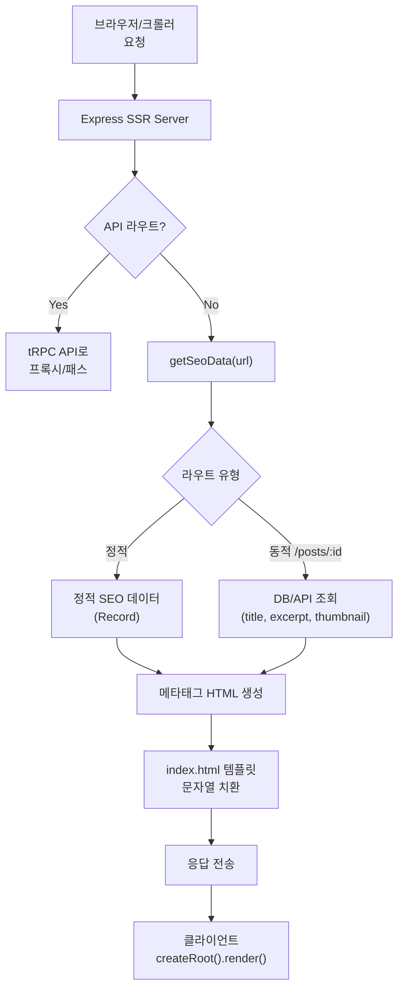

# SEO 전략 - Partial SSR

## 핵심 컨셉

**Partial SSR**: SEO에 필요한 메타태그/헤더만 서버에서 렌더링하고, 본문은 빈 컨테이너로 두어 클라이언트에서 render하는 방식.

| 구분                   | 방식                                          |
| ---------------------- | --------------------------------------------- |
| 서버 렌더링 대상       | `<head>` 메타태그 (title, description, OG 등) |
| 클라이언트 렌더링 대상 | `<body>` 본문 전체 (SPA)                      |
| React SSR              | **미사용** (renderToString 호출 없음)         |
| Hydration              | **미사용** (일반 createRoot().render() 사용)  |
| 서버 역할              | HTML 템플릿의 문자열 치환만 수행              |

## SSR 범위 구분

| 페이지 유형                     | SSR 범위          | 설명                                                                        |
| ------------------------------- | ----------------- | --------------------------------------------------------------------------- |
| 정적 페이지 (Landing, About 등) | 메타태그 SSR      | 정적 SEO 데이터                                                             |
| 유저 생성 Post                  | 최소 Header만 SSR | title, description, OG 태그만 서버 주입. 실제 freeContent/paidContent는 CSR |

## 아키텍처



## 앱 구조

### 주요 파일

| 파일                  | 역할                                         |
| --------------------- | -------------------------------------------- |
| `src/seo/SeoHead.tsx` | 메타태그 컴포넌트 (서버에서 문자열로 변환)   |
| `src/seo/routes.ts`   | 라우트별 SEO 데이터 정의                     |
| `server.ts`           | Express SSR 서버                             |
| `entry-client.ts`     | 클라이언트 엔트리 (일반 render)              |
| `index.html`          | HTML 템플릿 (`<!--seo-head-->` 플레이스홀더) |

### SeoHead 컴포넌트

서버에서 렌더링할 메타태그 목록:

| 태그                               | 용도                       |
| ---------------------------------- | -------------------------- |
| `<title>`                          | 페이지 제목                |
| `<meta name="description">`        | 페이지 설명                |
| `<meta property="og:title">`       | OG 제목                    |
| `<meta property="og:description">` | OG 설명                    |
| `<meta property="og:image">`       | OG 이미지 (Post thumbnail) |
| `<meta property="og:url">`         | OG URL                     |
| `<meta name="twitter:card">`       | Twitter 카드               |

### 라우트별 SEO 데이터 (`src/seo/routes.ts`)

```typescript
// 정적 라우트
const staticSeoData: Record<string, SeoData> = {
  '/': { title: 'Readly', description: '...' },
  '/about': { title: 'About - Readly', description: '...' },
};

// 동적 라우트 (DB/API 조회)
async function getDynamicSeoData(url: string): Promise<SeoData | null> {
  const postMatch = url.match(/^\/posts\/([a-z0-9-]+)$/);
  if (postMatch) {
    const post = await fetchPostSeoData(postMatch[1]);
    return {
      title: post.title,
      description: post.excerpt ?? '',
      ogImage: post.thumbnail,
    };
  }
  return null;
}
```

### HTML 템플릿 (`index.html`)

```html
<!DOCTYPE html>
<html>
  <head>
    <!--seo-head-->
  </head>
  <body>
    <div id="app"></div>
    <script type="module" src="/entry-client.ts"></script>
  </body>
</html>
```

### 서버 (`server.ts`)

```typescript
// Express 기반
// 개발: Vite middleware mode
// 프로덕션: dist/client 정적 서빙
app.use('*', async (req, res) => {
  const seoData = await getSeoData(req.originalUrl);
  const metaHtml = renderSeoHead(seoData);
  const html = template.replace('<!--seo-head-->', metaHtml);
  res.send(html);
});
```

### 클라이언트 Entry (`entry-client.ts`)

```typescript
// hydrate가 아닌 일반 render
createRoot(document.getElementById('app')!).render(<App />);
```

## 빌드

| 빌드 대상  | 명령어                                             | 출력         |
| ---------- | -------------------------------------------------- | ------------ |
| 클라이언트 | `vite build --outDir dist/client`                  | SPA 번들     |
| 서버       | `tsup server.ts --outDir dist/server --format esm` | Express 서버 |

## 장점

- React SSR(renderToString) 미사용으로 **서버 부하 최소**
- Hydration mismatch 걱정 없음
- 기존 SPA 코드 거의 그대로 유지
- 크롤러가 `<head>` 메타태그를 정상적으로 수집

## 타겟 및 한계

| 타겟                         | 지원 수준                                |
| ---------------------------- | ---------------------------------------- |
| OG 미리보기 (카카오톡, 슬랙) | 완전 지원 (메타태그 기반)                |
| Google SEO                   | 지원 (JS 실행으로 본문도 인덱싱)         |
| 네이버/다음                  | 제한적 (JS 렌더링 미지원 시 본문 미노출) |

> 네이버/다음 대응이 필요하면 본문 SSR 확장을 별도 검토합니다.

## 주의사항

- body 콘텐츠는 크롤러에 안 보임 (Google은 JS 실행하므로 OK)
- 동적 라우트 SEO 데이터 조회 시 **응답 속도 관리 필요** (캐싱 권장)
- Post SEO 데이터는 `freeContent`의 excerpt 기반으로 생성 (paidContent는 SEO에 노출하지 않음)

## 관련 문서

| 문서                       | 설명                                        |
| -------------------------- | ------------------------------------------- |
| `domain/overview.md`       | 서비스 구성 (SSR Server 포함)               |
| `domain/post.md`           | Post 도메인 (freeContent/paidContent 구조)  |
| `architecture/INDEX.md`    | 시스템 아키텍처                             |
| `architecture/frontend.md` | 프론트엔드 아키텍처 (TanStack Router, tRPC) |
