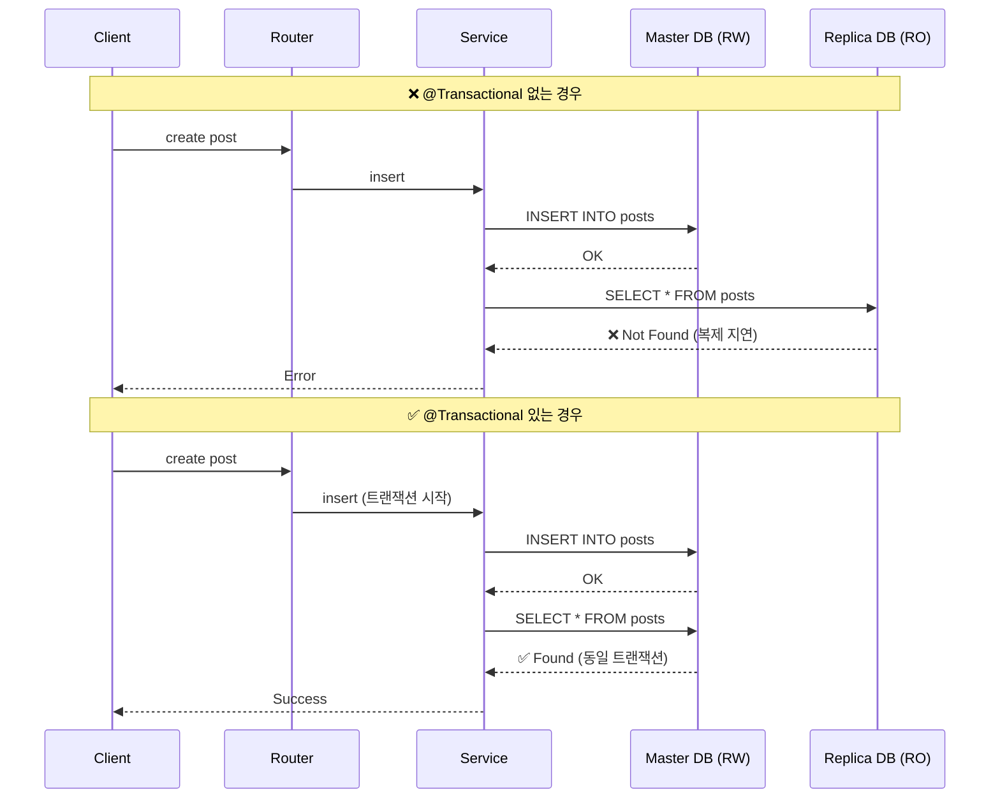
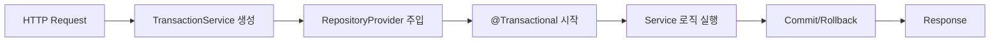

# 트랜잭션 관리

**RepositoryProvider와 TransactionService는 REQUEST 스코프로 동작하며, TypeORM 트랜잭션을 관리합니다.**

## @Transactional 데코레이터 (Mutation 필수)

```typescript
// ✅ Mutation에는 반드시 @Transactional 데코레이터 사용
@Mutation({
  input: createPostSchema,
  output: postResponseSchema,
})
@Transactional()  // 필수!
async create(
  @Input('title') title: string,
  @Input('content') content: string,
  @Ctx() ctx: any
) {
  return await this.microserviceClient.send('post.create', {
    title,
    content,
    authorId: ctx.user.id,
  });
}

// ❌ @Transactional 없이 Mutation 사용 금지
@Mutation({ input: schema, output: schema })
async update(...) {
  // RO DB 조회 문제 발생 가능!
}
```

## 왜 @Transactional이 필요한가?



**Master-Slave 복제 환경에서 INSERT 직후 조회 시, 복제 지연으로 인해 RO(Replica) DB에서 데이터를 찾지 못하는 문제가 발생합니다.**

`@Transactional` 데코레이터를 사용하면:

1. 트랜잭션 내 모든 쿼리가 Master(RW) DB로 실행됨
2. INSERT 후 즉시 조회해도 동일 트랜잭션 내에서 데이터 확인 가능
3. 데이터 정합성 보장

## 트랜잭션 스코프 흐름



## 체크리스트

- [ ] **모든 Mutation에 `@Transactional()` 데코레이터 적용**
- [ ] Query는 RO DB 사용 (데코레이터 불필요)
- [ ] INSERT/UPDATE 후 즉시 조회하는 로직은 반드시 트랜잭션 내에서 실행
