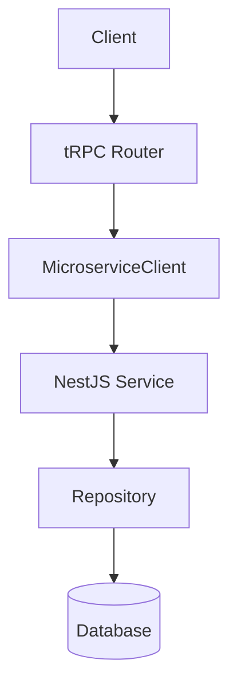
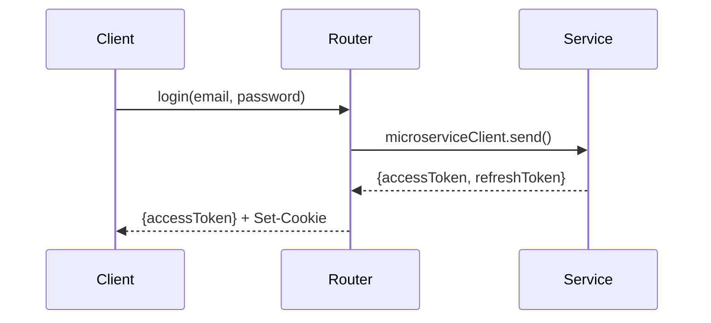
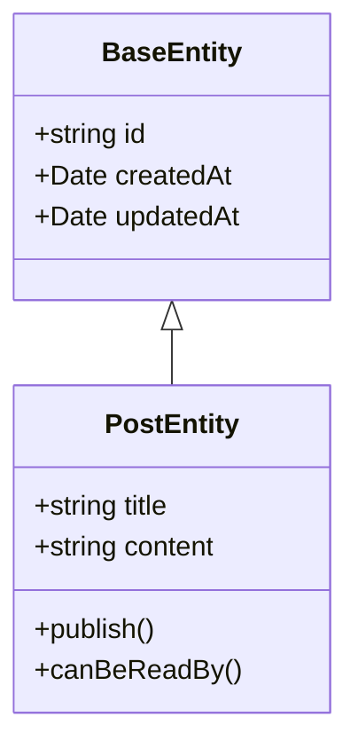

# Documentation Skill

## 개요

`.claude/` 폴더 내 Context와 Skill 문서 작성 규칙입니다.

## 폴더 구조

```
.claude/
├── context/                 # 배경지식 (읽기 전용 참조)
│   ├── INDEX.md            # Context 전체 인덱스
│   ├── architecture/       # 아키텍처 관련
│   │   ├── INDEX.md        # 폴더 root 파일
│   │   └── *.md            # 상세 파일
│   └── domain/             # 도메인 관련
│       ├── INDEX.md
│       └── *.md
└── skills/                  # 작업 가이드 (How-to)
    ├── api/
    │   ├── SKILL.md        # 폴더 root 파일
    │   └── *.md            # 상세 파일
    └── frontend/
        ├── SKILL.md
        └── *.md
```

## Frontmatter 형식

**모든 .md 파일 최상단에 필수:**

```yaml
---
name: 파일명 (영문, PascalCase 또는 kebab-case)
description: 한 줄 설명 (50자 이내 권장)
keywords: [키워드1, 키워드2, ...]
estimated_tokens: ~숫자
---
```

### 예시

```yaml
---
name: Backend-Architecture
description: 백엔드 Microservice + tRPC 하이브리드 아키텍처
keywords: [백엔드, tRPC, NestJS, Microservice, Transaction]
estimated_tokens: ~800
---
```

## 파일 길이 규칙

| 기준      | 줄 수     |
| --------- | --------- |
| 권장 범위 | 300~500줄 |
| 절대 최대 | 750줄     |

**500줄 초과 시:** 파일 분리 권장
**750줄 초과 시:** 파일 분리 필수

## 파일 분리 패턴

### Root 파일 (INDEX.md / SKILL.md)

- 개요 및 요약
- 상세 파일 참조 링크
- 빠른 참조 테이블

### 상세 파일

- 특정 주제에 대한 깊은 내용
- Root 파일에서 참조

### 참조 방식

```markdown
## 상세 문서

| 문서                         | 설명                     |
| ---------------------------- | ------------------------ |
| [backend.md](./backend.md)   | 백엔드 아키텍처 상세     |
| [frontend.md](./frontend.md) | 프론트엔드 아키텍처 상세 |

> 상세 내용은 [backend.md](./backend.md) 참조
```

## 다이어그램 (Mermaid)

**그래프/다이어그램 표현 시 Mermaid 사용:**

### 플로우차트



### 시퀀스 다이어그램



### 클래스 다이어그램



## Context vs Skill

| 구분      | Context               | Skill                   |
| --------- | --------------------- | ----------------------- |
| 목적      | 배경지식, 참조 정보   | 작업 방법, How-to       |
| 내용      | 아키텍처, 도메인 모델 | 개발 가이드, 체크리스트 |
| 예시      | "Post Entity 구조"    | "새 API 추가하는 방법"  |
| Root 파일 | INDEX.md              | SKILL.md                |

## 작성 원칙

1. **간결하게**: 핵심만 담기
2. **예시 포함**: 코드 예시 필수
3. **링크 활용**: 중복 대신 참조
4. **토큰 추정**: frontmatter에 명시
5. **Mermaid 활용**: 복잡한 흐름은 다이어그램으로
