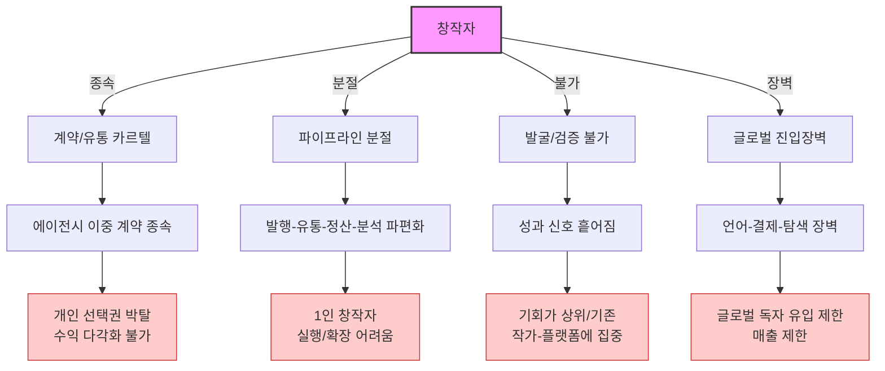
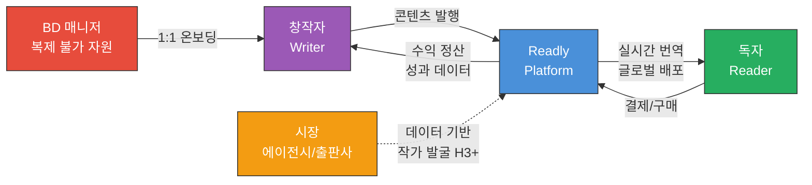
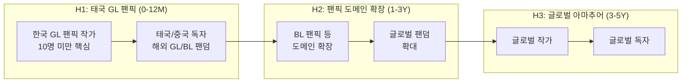
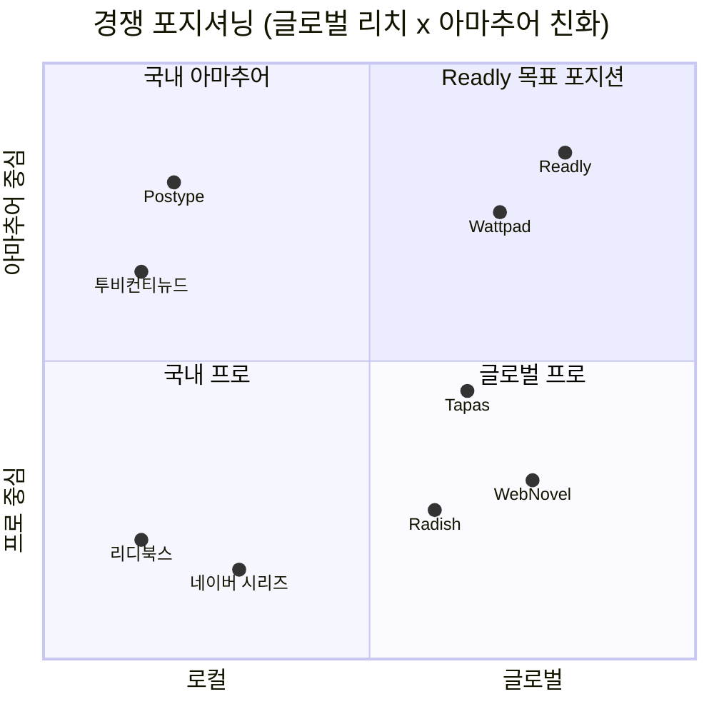
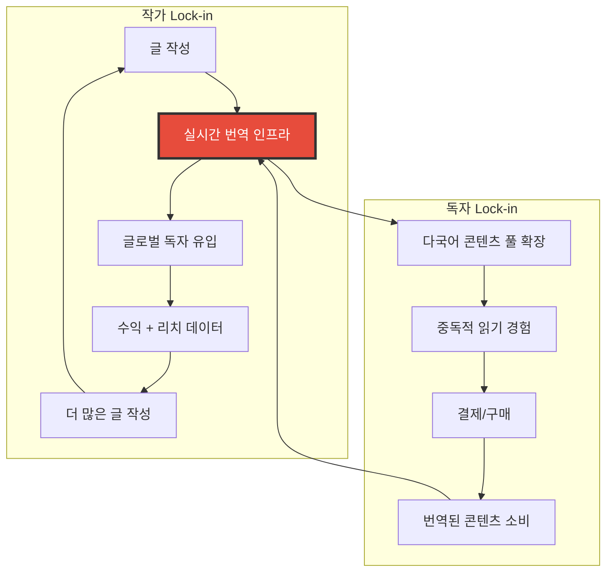
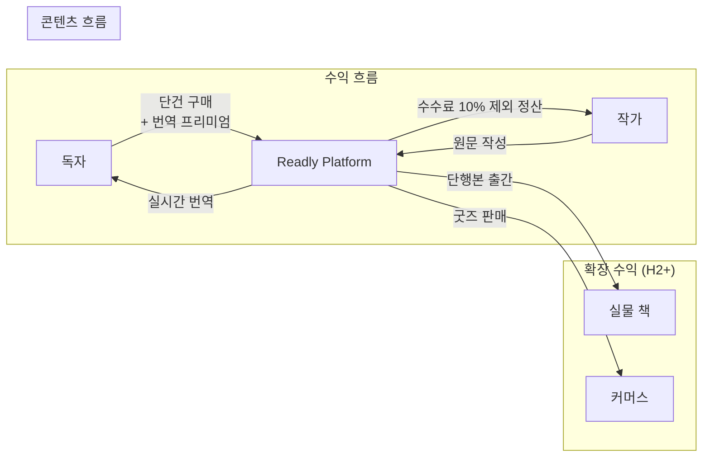
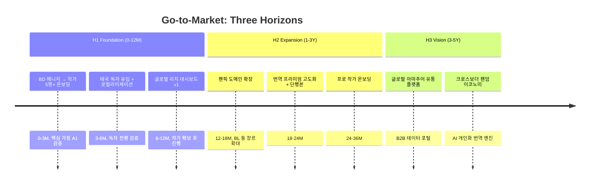
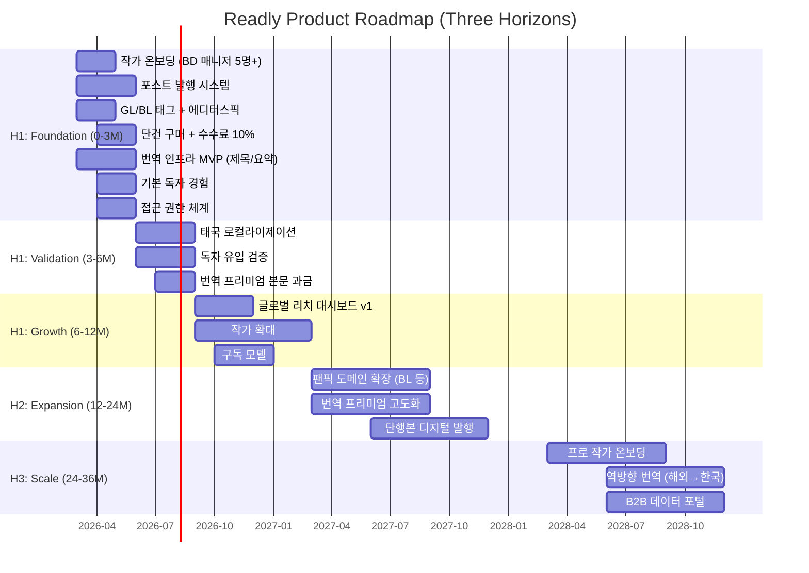

# Readly Product Brief

> **문서 유형**: Product Brief (Innovation Strategy 프레임워크)
> **작성일**: 2026-02-25
> **최종 수정일**: 2026-03-02
> **상태**: v2.0 (Cold Start Strategy 반영)
> **목적**: PRD 작성 시 참조하는 제품 전략 기초 문서
> **관련 문서**: `PM-DOCS/Planning/`, `.claude/context/business/`, `PM-DOCS/Context Output/innovation-strategy_2026-03-02_cold-start-business-model.md`

---

## 목차

1. [Vision & Mission](#1-vision--mission)
2. [Problem Statement](#2-problem-statement)
3. [Target Users](#3-target-users)
4. [Niche Market Focus](#4-niche-market-focus)
5. [Competitive Landscape](#5-competitive-landscape)
6. [Value Proposition & Lock-in](#6-value-proposition--lock-in)
7. [Business Model](#7-business-model)
8. [Go-to-Market Strategy](#8-go-to-market-strategy)
9. [Roadmap](#9-roadmap)
10. [Legal Risks](#10-legal-risks)

---

## 1. Vision & Mission

### Vision

> 1인 창작자의 풀퍼널 글로벌 유통 및 수익 다각화를 돕는 플랫폼

### Mission

계약에 묶이지 않고, **한 편부터 '번역-발행-판매-정산-데이터'를 한 번에 실행**할 수 있는 통합 인프라를 제공한다.

### 핵심 가치 정의

| 가치                 | 한 줄 정의                                                       |
| -------------------- | ---------------------------------------------------------------- |
| **창작자 자율성**    | 계약 종속 없이 발행-판매-해외 수출-정산-분석-고도화까지 1인 실행 |
| **글로벌 리치**      | 한 번 쓰면 N개 언어로 번역-발행-판매 원스톱                      |
| **데이터 기반 발굴** | 흩어진 성과 신호를 모아 "좋은 글"의 발굴 비용 절감               |
| **독자 접근성**      | 언어장벽 없이 전세계 콘텐츠를 실시간 번역으로 소비               |
| **이중 전략**        | 팬픽 코어(covert) + GL/BL 플랫폼 브랜딩(public)으로 시장 진입    |

---

## 2. Problem Statement

### 시장 배경: 성장하지만, 창작자에게 돈/기회가 전달되지 않는 구조

| 지표                  | 수치             | 의미                                  |
| --------------------- | ---------------- | ------------------------------------- |
| 국내 창작자 평균 보수 | **1,055만원/年** | 전업 생존 불가 수준                   |
| 투잡 비율             | **47.5%**        | 절반이 창작만으로 생계 유지 불가      |
| 창작 활동 이탈/단절률 | **23%**          | 4명 중 1명이 이탈, 동일 시나리오 반복 |
| 한국 IP 해외 수요     | **증가 추세**    | 유통 방식 한계로 접근성 부족          |

### 구조적 병목 분석

| 병목                 | 현재 상태                                   | 결과                                |
| -------------------- | ------------------------------------------- | ----------------------------------- |
| **계약/유통 카르텔** | 에이전시 이중 계약 종속 불가피              | 개인 선택권 박탈, 수익 다각화 불가  |
| **파이프라인 분절**  | 발행-유통-정산-분석 파편화                  | 1인 창작자 실행/확장 어려움         |
| **발굴/검증 불가**   | 성과 신호가 흩어져 "좋은 글" 발굴 비용 증가 | 기회가 상위/기존 작가-플랫폼에 집중 |
| **글로벌 진입장벽**  | 언어-결제-탐색 장벽                         | 글로벌 독자 유입 제한, 매출 제한    |

### Cold Start 재정의

> Cold Start = **"수요 창출이 아닌 기존 수요의 합법적 연결"**

| 근거               | 상세                                                              |
| ------------------ | ----------------------------------------------------------------- |
| **BD 매니저**      | 사내 이사, 10명 미만 핵심 작가와 신뢰 관계 보유, 본인도 팬픽 작가 |
| **해외 무단 번역** | 중국 웨이보에서 무단 번역이 발생할 정도로 해외 수요 존재          |
| **번역 요청**      | 독자로부터 직접 번역 요청 발생                                    |

닭과 달걀 중 무엇이 먼저인가가 아니다. 이미 닭(작가)도 달걀(독자)도 존재한다. 문제는 둘을 연결하는 **합법적이고 수익화 가능한 채널**이 없다는 것이다. 물이 없는 것이 아니라, **수도관이 없는 것**이다.

### 결론

> 창작자가 계약에 묶이지 않고, 한 편부터 **번역-발행-판매-정산-데이터**를 한 번에 실행할 수 있는 통합 인프라가 필요하다. 그리고 그 인프라의 첫 번째 파이프라인은 이미 존재하는 수요를 연결하는 것이다.

---

## 3. Target Users

### 3.1 창작자 (Writer)

**프로필**: 태국 GL 팬픽 작가 10명 미만 핵심 그룹이 초기 타겟. BD 매니저의 기존 신뢰 관계를 기반으로 온보딩하며, 플랫폼/에이전시 계약 없이 콘텐츠를 쉽게 발행하고 다각도로 수익화하고 싶은 아마추어 작가.

| 속성            | 상세                                                                             |
| --------------- | -------------------------------------------------------------------------------- |
| **핵심 니즈**   | 계약 종속 없이 발행-판매-해외 수출-정산까지 1인 실행 + **글로벌 리치 경험**      |
| **JTBD**        | 기능: 글로벌 발행+수익화 / 감정: **"태국에서 340명이 읽었다"** / 사회: 프로 인정 |
| **현재 행동**   | 포스타입, 개인 블로그, SNS 등 파편화된 채널에서 활동                             |
| **Pain Point**  | 글로벌 독자 접근 불가, 수익화 경로 제한, **수수료 30%+ 과다**, 데이터/분석 부재  |
| **기대 가치**   | 취미 활동의 수익화 + 글로벌 독자에게 읽히는 경험                                 |
| **온보딩 경로** | BD 매니저 1:1 관계 기반 (자본으로 복제 불가)                                     |

### 3.2 독자 (Reader)

**프로필**: 해외 GL/BL 팬덤 (태국, 중국 1차). 좋아하는 작가의 콘텐츠를 합법적으로, 자신의 언어로 읽고 싶은 사람.

| 속성           | 상세                                                                                          |
| -------------- | --------------------------------------------------------------------------------------------- |
| **핵심 니즈**  | 실시간 다국어로 작품을 쉽게 탐색-결제-소비                                                    |
| **JTBD**       | 기능: 합법 접근+번역 / 감정: **"덕질의 합법화"** / 사회: 팬덤 소속감                          |
| **Trigger**    | **"좋아하는 작가가 여기 있다"** = 작가가 플랫폼을 결정                                        |
| **현재 행동**  | ChatGPT/DeepL로 수동 번역, 무단 번역 사이트 이용, 구글링으로 연재처 탐색                      |
| **Pain Point** | 합법 접근 경로 부재, 언어 장벽, 번역 품질 불균일, **적응된 고통 (무단 번역에 익숙해진 상태)** |
| **기대 가치**  | 양질의 콘텐츠를 자연스러운 번역으로 중독적 읽기 경험                                          |

> **핵심 인사이트**: 독자의 "적응된 고통"(불편을 당연시하는 상태) = **최대 기회**. 합법적이고 편리한 대안이 나타나면 전환 장벽이 낮다.

### 3.3 시장 (에이전시/출판사) -- H3 이후

**프로필**: 인기 많고 작품성 좋은 작품/작가를 섭외하고 싶은 곳

| 속성           | 상세                                |
| -------------- | ----------------------------------- |
| **핵심 니즈**  | 데이터 기반 작품/작가 발굴 및 검증  |
| **현재 행동**  | 수동 스카우팅, 구전/소문 기반 섭외  |
| **Pain Point** | 발굴/검증 불가로 기회 불균형 발생   |
| **기대 가치**  | 성과 데이터를 통한 효율적 작가 발굴 |

### 3.4 BD 매니저 (복제 불가 자원)

**프로필**: 사내 이사, 본인도 팬픽 작가. 10명 미만 핵심 작가와 직접적인 신뢰 관계를 보유한 유일한 인물.

| 속성            | 상세                                                                   |
| --------------- | ---------------------------------------------------------------------- |
| **역할**        | Cold Start의 첫 번째 파이프라인                                        |
| **자산**        | 핵심 작가와의 신뢰 관계 (자본으로 구매 불가)                           |
| **복제 불가성** | 사내 이사 + 작가 본인 + 팬덤 도메인 지식 = 경쟁사가 채용으로 복제 불가 |
| **유입 시퀀스** | **BD 매니저 → 작가 → 독자** (이 순서만이 유일한 시퀀스)                |

### 사용자 관계 다이어그램

---

## 4. Niche Market Focus

### 타겟 시장: 팬픽션(Fanfiction)

대표적인 아마추어 음지 시장으로, **콘텐츠가 항상 부족**한 특성을 가진다.

| 항목              | 상세                                         |
| ----------------- | -------------------------------------------- |
| **콘텐츠 유형**   | 드라마/연예인 대상 2차 창작물                |
| **핵심 장르**     | BL/GL (대외적 노출은 제한적이나 실질적 타겟) |
| **1차 타겟 지역** | 태국, 중국                                   |
| **2차 확장 지역** | 글로벌 전역                                  |

### 시장 규모

| 구분    | 규모               | 산출 근거                            |
| ------- | ------------------ | ------------------------------------ |
| **TAM** | ~$1.65B (2027)     | 글로벌 디지털 창작 콘텐츠 유료 시장  |
| **SAM** | $15M ~ $30M        | 한국어 GL/BL 웹소설 + 팬픽 유료 시장 |
| **SOM** | $150K ~ $500K (Y1) | Readly 1년차 실현 가능 매출          |

### 수요-공급 불균형

| 지표                | 수치       | 의미               |
| ------------------- | ---------- | ------------------ |
| 태국 GL 팬픽 작가   | **~200명** | 검증된 공급 기반   |
| 일반 GL 대비 조회수 | **3~14배** | 수요 강도 증명     |
| 해외 수요 배율      | **10배+**  | 글로벌 확장 잠재력 |

### 팬픽션 시장의 특수성

| 특성              | 설명                                     | 전략적 의미                           |
| ----------------- | ---------------------------------------- | ------------------------------------- |
| **인물 고정**     | 특정 연예인을 주인공으로 고정            | GL/BL 장르 태그 + 에디터스픽 큐레이션 |
| **리얼리티 지향** | 모델의 성격/성향을 사실적으로 반영       | 작가의 몰입도와 독자 만족도 정비례    |
| **시한부 콘텐츠** | 콘텐츠 수명 = 연예인 인기에 정비례       | 트렌드 기반 큐레이션 중요             |
| **아마추어 독점** | 프로 작가는 공식적으로 팬픽 안 씀        | 아마추어 작가 지원 시스템이 핵심      |
| **GL 시장 갈증**  | GL 시장은 BL 대비 규모가 압도적으로 작음 | 양질의 GL 콘텐츠 확보가 강력한 차별화 |

### 독자 Pain Point 분석 (VPC 기반)

| Pain                    | 현재 상태               | Readly Gain                  |
| ----------------------- | ----------------------- | ---------------------------- |
| 합법적 콘텐츠 접근 불가 | 무단 번역 사이트 의존   | 작가가 있는 곳에서 합법 구매 |
| 언어 장벽               | ChatGPT/DeepL 수동 번역 | 실시간 번역으로 소비         |
| 번역 품질 불균일        | 무단 번역의 낮은 품질   | 번역 프리미엄 고품질 번역    |
| **적응된 고통**         | 불편을 당연시하는 상태  | **적응된 고통 = 최대 기회**  |

> 커뮤니티 데이터 근거: 16회 Exa 서치로 검증한 해외 팬덤 수요 실재.

### Porter's Five Forces 요약

| Force          | 평가     | Readly 유리 요인                                 |
| -------------- | -------- | ------------------------------------------------ |
| 신규 진입 위협 | **낮음** | BD 매니저 + 번역 인프라 = 복제 불가 진입 장벽    |
| 대체재 위협    | **낮음** | 무단 번역/SNS 공유는 수익화 불가                 |
| 공급자 교섭력  | **중간** | 작가 10명 미만 핵심 의존 → BD 매니저 관계로 완화 |
| 구매자 교섭력  | **낮음** | 대체 합법 채널 부재                              |
| 기존 경쟁      | **낮음** | 해당 니치에 직접 경쟁자 없음 (Blue Ocean)        |

### 시장 진입 전략: Three Horizons 기반 Niche-to-Mass

---

## 5. Competitive Landscape

### 직접 경쟁사 비교

| 서비스                | 타겟           | 수익 모델 | 글로벌   | 번역            | 아마추어 지원 | 수수료   |
| --------------------- | -------------- | --------- | -------- | --------------- | ------------- | -------- |
| **WebNovel**          | 프로/프로 지향 | 유료 챕터 | O        | 수동/부분       | 낮음          | -        |
| **Radish Fiction**    | 프로/프로 지향 | 유료 챕터 | O        | 수동            | 낮음          | -        |
| **Tapas**             | 프로/프로 지향 | 광고+유료 | O        | 수동            | 중간          | -        |
| **Wattpad**           | 아마추어 중심  | 광고+유료 | O        | 수동            | 높음          | -        |
| **리디북스**          | 프로           | 유료 판매 | X        | X               | 낮음          | 50%+     |
| **네이버 시리즈**     | 프로           | 유료 챕터 | O (부분) | 수동            | 낮음          | -        |
| **포스타입(Postype)** | 아마추어 중심  | 유료 구독 | X        | X               | 높음          | **30%+** |
| **투비컨티뉴드**      | 아마추어 중심  | 유료 구독 | X        | X               | 중간          | -        |
| **Readly**            | 아마추어 중심  | 유료 구매 | **O**    | **실시간 자동** | **높음**      | **10%**  |

### PMF 검증 근거: 포스타입(Postype) 2025 실적

| 지표        | 수치         |
| ----------- | ------------ |
| 유료 결제자 | **112만 명** |
| 크리에이터  | **8.8만 명** |
| 연매출      | **~$7.5M**   |

포스타입은 한국에서 팬픽 유료화 모델을 이미 검증했다. 블로그 형태이지만 실질적으로 팬픽/아마추어 소설/웹툰 플랫폼이며, 아마추어 창작자가 유료 콘텐츠로 수익화할 수 있음을 증명한다.

### Readly vs 포스타입 차별점

| 차별화 축            | 포스타입  | Readly                            |
| -------------------- | --------- | --------------------------------- |
| **수수료**           | **30%+**  | **10% (차등)**                    |
| **번역**             | 미지원    | 실시간 이중 번역 시스템           |
| **글로벌 독자**      | 한국 한정 | 태국/중국 1차, 이후 글로벌        |
| **로컬라이제이션**   | 한국어만  | 회원가입-결제까지 로컬라이제이션  |
| **독자 Integration** | 없음      | 해외 독자 전용 Integration 시스템 |
| **데이터/분석**      | 기본 통계 | 글로벌 리치 대시보드 (차후)       |

### Strategy Canvas (14개 요소)

| 요소           | Readly            | Postype   | Ridi     |
| -------------- | ----------------- | --------- | -------- |
| 수수료         | **10% (최저)**    | 30%+      | 50%+     |
| 전속 계약      | **없음**          | 없음      | 있음     |
| 글로벌 리치    | **높음**          | 없음      | 낮음     |
| 번역 인프라    | **있음**          | 없음      | 없음     |
| 알고리즘 추천  | **없음 (의도적)** | 있음      | 있음     |
| 큐레이션       | **에디터스픽**    | 자동      | 편집부   |
| 작가 자율성    | **최고**          | 높음      | 낮음     |
| 수익 투명성    | 높음 (차후)       | 중        | 낮음     |
| 콘텐츠 다양성  | 낮음 (초기)       | 높음      | 높음     |
| 독자 규모      | 낮음 (초기)       | **112만** | **최대** |
| 브랜드 인지도  | 낮음 (초기)       | 높음      | **최고** |
| GL/BL 특화     | **최고**          | 중        | 중       |
| 해외 독자 접근 | **최고**          | 없음      | 낮음     |
| 팬픽 친화성    | **최고** (covert) | 높음      | 낮음     |

### ERRC Grid

| 전략          | 요소                 | 설명                                           |
| ------------- | -------------------- | ---------------------------------------------- |
| **Eliminate** | 전속 계약            | 작가 자율성 극대화                             |
|               | 지역 잠금            | 글로벌 동시 발행                               |
|               | 알고리즘 경쟁        | GL/BL 장르 태그 + 에디터스픽 큐레이션으로 대체 |
| **Reduce**    | 수수료 → 10%         | 포스타입 30%+ 대비                             |
|               | 편집 부담            | 간소화된 발행 워크플로우                       |
|               | 검열                 | 작가 자율 등급 설정                            |
| **Raise**     | 수익 투명성          | 실시간 정산 + 글로벌 데이터 (차후)             |
|               | 작가 자율성          | 가격/권한/발행 일정 완전 통제                  |
|               | 번역 품질            | AI 번역 + 프리미엄 번역 옵션                   |
| **Create**    | 실시간 번역 인프라   | 탐색 무료 + 구매시 프리미엄                    |
|               | 글로벌 리치 대시보드 | 국가별 독자 현황 (차후)                        |
|               | 번역 프리미엄 모델   | 비용 센터 → 수익 센터 전환                     |
|               | BD 매니저 온보딩     | 복제 불가 채널                                 |
|               | 크로스보더 팬덤 연결 | 언어 장벽 없는 팬덤                            |

### 경쟁 포지셔닝 맵

---

## 6. Value Proposition & Lock-in

### 작가 핵심 가치: "Write Once, Reach Global"

| 기능                     | 설명                                                 | 작가에게의 의미                       |
| ------------------------ | ---------------------------------------------------- | ------------------------------------- |
| **자동 다국어 발행**     | 한 번 쓰면 N개 언어로 번역-발행-판매                 | "내가 번역을 신경쓸 필요 없다"        |
| **글로벌 리치 대시보드** | 내 글이 어느 나라에서 몇 명에게 읽히는지 실시간 확인 | "태국에서 340명이 내 글을 읽었습니다" |
| **계약 종속 없음**       | 플랫폼에 종속되지 않는 자유 발행                     | "내 작품의 권리는 내가 가진다"        |
| **취미의 수익화**        | 아마추어 활동에서 실질 수익 창출                     | "좋아하는 일로 돈을 벌 수 있다"       |
| **착한 수수료**          | 10% 차등 수수료 (포스타입 30%+ 대비)                 | "수수료 걱정 없이 판매한다"           |

### 독자 핵심 가치: "Read Global, No Barrier"

| 기능                    | 설명                                       | 독자에게의 의미               |
| ----------------------- | ------------------------------------------ | ----------------------------- |
| **실시간 번역 읽기**    | ChatGPT 없이 자연스러운 번역으로 바로 읽기 | "번역기 돌리지 않아도 된다"   |
| **이중 리더**           | 원문+번역을 나란히/토글로 열람 가능        | "원문도 보면서 읽을 수 있다"  |
| **에디터스픽 큐레이션** | 사용자 본인이 직접 운영하는 큐레이션       | "좋은 글을 쉽게 찾을 수 있다" |
| **통합 접근**           | 파편화된 연재처를 한 곳에서                | "구글링 안 해도 된다"         |
| **합법적 소비**         | 좋아하는 작가를 직접 지원                  | "덕질을 합법적으로 한다"      |

### JTBD (Jobs to Be Done) -- 감정적 Job이 전환의 열쇠

| Job 유형       | 작가                          | 독자                      |
| -------------- | ----------------------------- | ------------------------- |
| **기능적 Job** | 글로벌 발행 + 수익화          | 합법적 콘텐츠 접근 + 번역 |
| **감정적 Job** | **"내 글이 세계에서 읽힌다"** | **"덕질의 합법화"**       |
| **사회적 Job** | 프로 작가로 인정              | 팬덤 커뮤니티 소속감      |

> 기능만으로는 플랫폼 전환 비용을 넘을 수 없다. **감정적 Job이 전환의 열쇠**이다.
>
> - 작가 Trigger: "태국에서 340명이 읽었다"
> - 독자 Trigger: "좋아하는 작가가 여기 있다"

### 이중 파괴 전략 (Dual Disruption)

| 전략 축    | 유형                  | 핵심 논리                                                                                 |
| ---------- | --------------------- | ----------------------------------------------------------------------------------------- |
| **주축**   | New-market Disruption | "갈증이 있는데 물이 없는 non-consumption" 해소. 해외 GL/BL 독자에게 합법적 유통 채널 제공 |
| **보조축** | Low-end Disruption    | 트레이드오프 없는 저수수료(10%) + 글로벌 리치. 기존 플랫폼 대비 "더 싸면서 더 넓음"       |

이중 파괴는 동시에 **이중 방어벽**을 형성한다: New-market 측면에서 기존 플랫폼이 접근하지 않는 시장을 선점하고, Low-end 측면에서 수수료 경쟁력으로 작가 이탈을 방지한다.

### 에디터스픽 큐레이션

알고리즘 추천을 의도적으로 Eliminate하고, 에디터스픽(사용자 본인 직접 운영) 큐레이션으로 대체한다.

| 결정                        | 근거                                                           |
| --------------------------- | -------------------------------------------------------------- |
| 알고리즘 Eliminate          | 알고리즘 = 대형 플랫폼 게임, 니치에서는 큐레이션이 우위        |
| GL/BL 장르 태그만 지원      | 광범위 장르 수준의 자동 태그만                                 |
| **커플링명 직접 태그 불가** | 초상권 신고 리스크, 아이돌 서치 방지 약어 문화, 태그 오염 문제 |
| 에디터스픽 = 복제 불가 Moat | 사용자 본인의 팬덤 도메인 지식 활용                            |

### 기술 코어: 실시간 번역 인프라

실시간 번역 인프라는 양쪽(작가/독자) Lock-in의 기반 기술이자, 양면 시장의 Bridge이다.

---

## 7. Business Model

### BMC 9블록 요약

| 블록                       | 내용                                                                  |
| -------------------------- | --------------------------------------------------------------------- |
| **Key Partners**           | BD 매니저, 번역 API 제공사, 결제 PG                                   |
| **Key Activities**         | 작가 온보딩, 번역 인프라 운영, 에디터스픽 큐레이션                    |
| **Key Resources**          | BD 매니저(복제 불가), 번역 파이프라인, 작가 네트워크                  |
| **Value Proposition**      | 작가: 전속 계약 없는 글로벌 수익화 / 독자: 언어 장벽 없는 콘텐츠 접근 |
| **Customer Relationships** | 작가: BD 매니저 1:1 / 독자: 셀프서비스 + 에디터스픽                   |
| **Channels**               | 웹 플랫폼, 팬덤 커뮤니티, SNS                                         |
| **Customer Segments**      | 작가: 태국 GL 팬픽 작가 / 독자: 해외 GL/BL 팬덤                       |
| **Revenue Streams**        | 수수료(최대 10% 차등) + 번역 프리미엄 + 구독(차후)                    |
| **Cost Structure**         | 번역 API + 인프라 + 개발 인건비                                       |

### 수익 구조

| 수익원               | 설명                                           | 시기                           | 우선순위 |
| -------------------- | ---------------------------------------------- | ------------------------------ | -------- |
| **단건 구매 수수료** | 콘텐츠 거래 시 **최대 10% 차등** 플랫폼 수수료 | Day 1 MVP                      | 핵심     |
| **번역 프리미엄**    | 탐색 무료(제목/요약) + 구매시 자동 과금        | Day 1 MVP (탐색) / 차후 (본문) | 핵심     |
| **구독 모델**        | 작가별 정기 구독                               | 차후 별도 기획                 | 확장     |
| **단행본 출간**      | 인기 작가의 커스텀 단행본 발행                 | H2                             | 확장     |
| **커머스**           | 굿즈, 단행본 구매                              | H3                             | 장기     |
| **부가 기능**        | 앱 내 추가 부가 기능 구매                      | H3                             | 장기     |

### 번역 프리미엄 모델: 비용 센터 → 수익 센터

| 단계     | 과금          | 대상                       | 설명                     |
| -------- | ------------- | -------------------------- | ------------------------ |
| **탐색** | **무료**      | 썸네일/제목/요약 자동 번역 | 독자 진입 장벽 최소화    |
| **구매** | **자동 과금** | 번역 프리미엄 포함 결제    | 번역 비용이 곧 수익 모델 |

번역은 비용이 아니라 수익이다. 탐색 단계에서 무료 번역으로 독자를 유입하고, 구매 단계에서 번역 프리미엄을 자동 과금하여 **비용 센터를 수익 센터로 전환**한다.

### 가격 벤치마크

| 플랫폼   | 가격대                      |
| -------- | --------------------------- |
| 포스타입 | 5,000자 500~1,000원         |
| 리디 GL  | 1권 ~3,900원                |
| Readly   | 작가 자율 가격 + 수수료 10% |

### 가치 흐름

---

## 8. Go-to-Market Strategy

### Cold Start 전략: 수요 창출이 아닌 기존 수요의 합법적 연결

**유일한 유입 시퀀스**: BD 매니저 → 작가 → 독자

| 단계 | 액션                              | 기대 효과                 | Trigger                         |
| ---- | --------------------------------- | ------------------------- | ------------------------------- |
| 1    | BD 매니저가 핵심 작가 5명+ 온보딩 | 핵심 콘텐츠 공급원 확보   | BD 매니저의 신뢰 관계           |
| 2    | 작가의 기존 팬이 플랫폼 이동      | 초기 독자 풀 형성         | **"좋아하는 작가가 여기 있다"** |
| 3    | 번역 콘텐츠로 글로벌 독자 유입    | 작가에게 글로벌 리치 경험 | 합법 + 번역 = 전환              |
| 4    | 작가 입소문 확산                  | 유기적 성장 시작          | **"태국에서 340명이 읽었다"**   |

### 마케팅 메시지 (이중 브랜딩)

| 대상     | Public 메시지 (GL/BL 플랫폼)                | Covert 메시지 (팬픽 코어)                    |
| -------- | ------------------------------------------- | -------------------------------------------- |
| **작가** | "글로벌 독자에게 GL/BL 작품을 소개하세요"   | "팬픽을 글로벌에 합법적으로 판매하세요"      |
| **독자** | "한국의 양질의 GL/BL 작품을, 당신의 언어로" | "좋아하는 작가의 팬픽을 합법적으로 읽으세요" |

### Phase별 확장 전략: Three Horizons

### 핵심 가정 & 검증 계획

| ID     | 가정                              | 검증 시기 | 검증 방법             | 실패시 Plan B               |
| ------ | --------------------------------- | --------- | --------------------- | --------------------------- |
| **A1** | BD 매니저가 5명+ 작가 온보딩 가능 | 0-2M      | 작가 LOI 확보         | 3명 micro-MVP로 축소        |
| **A2** | 독자가 작가를 따라 플랫폼 이동    | 2-4M      | 독자 가입/구매 전환율 | 독점 콘텐츠 + 무료 미리보기 |
| **A3** | 해외 독자가 번역 프리미엄 지불    | 4-6M      | 번역 프리미엄 결제율  | 무료 번역 + 수수료 인상     |
| **A4** | 10% 수수료로 Unit Economics 성립  | 3-6M      | 수익/비용 분석        | 수수료 조정 or 구독 전환    |
| **A5** | GL/BL 브랜딩이 팬픽 코어를 가림   | 6-9M      | 외부 인식 조사        | 중립 브랜딩 or 별도 랜딩    |

---

## 9. Roadmap

### Day 1 MVP: Must-have 7개 기능

| #   | 기능                                   | 분류          | 비고                       |
| --- | -------------------------------------- | ------------- | -------------------------- |
| 1   | 작가 온보딩 (BD 매니저 경유, 최소 5명) | Quick Win     | 핵심 가정 A1 검증          |
| 2   | 포스트 작성/발행 시스템                | Core          | 기본 기능                  |
| 3   | GL/BL 장르 태그 + 에디터스픽 큐레이션  | Quick Win     | 알고리즘 대체              |
| 4   | 단건 구매 + 수수료 10% 차등            | Quick Win     | 수익 모델                  |
| 5   | 번역 인프라 MVP (제목/요약 자동 번역)  | Long-term Bet | **핵심 경쟁력, 포기 불가** |
| 6   | 기본 독자 경험 (열람/구매)             | Core          | 기본 기능                  |
| 7   | 접근 권한 (전체공개/구매자 전용)       | Core          | 최소 권한 체계             |

### Day 1 제외 (차후 기획)

| 항목                      | 사유                           | 예상 시기 |
| ------------------------- | ------------------------------ | --------- |
| 구독 모델                 | 차후 별도 기획                 | H1 후반   |
| 번역 프리미엄 본문 과금   | Day 1은 탐색 번역(제목/요약)만 | H1 후반   |
| 글로벌 리치 대시보드      | 작가 확보 후                   | 6-12M     |
| 태국 로컬라이제이션       | H1 후반                        | 3-6M      |
| 수익 투명성 대시보드      | 차후 별도 기획                 | H1 후반   |
| 팬픽 도메인 확장          | BD 매니저 동일 메커니즘 복제   | H2        |
| 구독자 전용 / 비공개 권한 | 차후 확장                      | H1 후반   |

### Execution Roadmap

| Phase          | 시기   | 핵심 목표                           | KPI                               |
| -------------- | ------ | ----------------------------------- | --------------------------------- |
| **Foundation** | 0-3M   | Day 1 MVP 런칭, 작가 5명+ 온보딩    | 작가 수, 포스트 수                |
| **Validation** | 3-6M   | 독자 유입 검증, 태국 로컬라이제이션 | 독자 수, 구매 전환율              |
| **Growth**     | 6-12M  | 글로벌 리치 대시보드, 작가 확대     | MAU, 매출, 해외 독자 비율         |
| **Expansion**  | 12-24M | 팬픽 도메인 확장, 단행본 디지털     | 장르 다양성, 신규 도메인 매출     |
| **Scale**      | 24-36M | 프로 작가, 역방향 번역              | 프로 작가 비율, 크로스보더 거래량 |

### Roadmap Overview

---

## 10. Legal Risks

### Risk Matrix

| ID  | 리스크                 | 영향도   | 발생 확률 | 완화 전략                             |
| --- | ---------------------- | -------- | --------- | ------------------------------------- |
| R1  | **작가 온보딩 실패**   | Critical | 중        | BD 매니저 관계 활용, micro-MVP 폴백   |
| R2  | **번역 품질 미달**     | 높음     | 중        | 다중 번역 API + 작가 검수 옵션        |
| R3  | **BD 매니저 이탈**     | Critical | 낮음      | 사내 이사 = 이해관계 일치, 지분 구조  |
| R4  | **수수료 수익성 부족** | 높음     | 중        | 번역 프리미엄으로 보전, 차등 조정     |
| R5  | **법적/저작권 리스크** | 높음     | 중        | 팬픽 코어 비공개, GL/BL 브랜딩 분리   |
| R6  | **경쟁사 해외 진출**   | 중       | 낮음      | 대규모 조직 의사결정 느림 = 선점 시간 |

### 법적 미검토 사항

| 리스크        | 상세                                             | 영향도 | 상태   |
| ------------- | ------------------------------------------------ | ------ | ------ |
| **초상권**    | 실제 연예인 기반 팬픽션의 초상권 문제            | 높음   | 미검토 |
| **저작권**    | 2차 창작물 수익화의 저작권 이슈                  | 높음   | 미검토 |
| **개인정보**  | 글로벌 서비스의 GDPR/PDPA 등 각국 개인정보보호법 | 중간   | 미검토 |
| **결제/정산** | 해외 결제 라이선스, 외환 규정                    | 중간   | 미검토 |

### Cold Start 딥다이브에서 발견된 구체적 리스크

| 리스크                    | 상세                                                                                             | 완화 전략                                                          |
| ------------------------- | ------------------------------------------------------------------------------------------------ | ------------------------------------------------------------------ |
| **커플링명 태그**         | 실제 인물명/커플링명을 태그로 사용 시 초상권 신고 리스크                                         | GL/BL 광범위 장르 태그만 지원, 커플링명 직접 태그 불가             |
| **아이돌 서치 방지 약어** | 팬덤에서 아이돌 검색 노출 방지를 위해 약어 사용하는 문화 → 플랫폼이 이를 해체하면 팬덤 신뢰 붕괴 | 플랫폼 차원에서 약어 문화를 존중, 강제 노출 금지                   |
| **이중 브랜딩 법적 함의** | GL/BL 플랫폼(public) + 팬픽 코어(covert) 이중 구조의 법적 경계                                   | 공식 브랜딩은 GL/BL 장르 플랫폼으로 유지, 팬픽 관련 면책 조항 설계 |

### 권고 사항

1. MVP 출시 전 초상권/저작권에 대한 법적 검토 반드시 선행
2. 팬픽션 수익화에 대한 면책 조항 및 이용약관 설계
3. 1차 타겟 지역(태국, 중국)의 현지 법률 검토
4. 글로벌 서비스 확장 시 각국 개인정보보호법 컴플라이언스 계획 수립
5. 커플링명/인물명 태그 정책에 대한 법적 자문
6. 이중 브랜딩 구조의 법적 리스크 사전 검토

---

## 부록

### A. PRD 작성 시 참조 가이드

이 Product Brief를 기반으로 PRD를 작성할 때 각 섹션이 어떻게 매핑되는지 정리한다.

| Product Brief 섹션 | PRD 매핑                                         |
| ------------------ | ------------------------------------------------ |
| Vision & Mission   | PRD 1. 개요 - 배경 및 목적                       |
| Problem Statement  | PRD 2. 목표 & 성공 지표 - 비즈니스 목표 근거     |
| Target Users       | PRD 3. 유저스토리 - 역할 정의                    |
| Niche Market Focus | PRD 2. 목표 & 성공 지표 - 시장 컨텍스트          |
| Value Proposition  | PRD 3. 유저스토리 - 가치 정의                    |
| Business Model     | PRD 10. 우선순위 & 스코프 - 비즈니스 임팩트 근거 |
| Go-to-Market       | PRD 10. 우선순위 & 스코프 - Phase 정의 근거      |
| Roadmap            | PRD 10. 우선순위 & 스코프 - MVP vs 후속          |
| Legal Risks        | PRD 9. 엣지 케이스 & 에러 처리 - 법적 제약       |

### B. 관련 CIS 문서

| 문서                 | 경로                                                                                 | 설명                                         |
| -------------------- | ------------------------------------------------------------------------------------ | -------------------------------------------- |
| Cold Start Deep Dive | `PM-DOCS/Context Output/innovation-strategy_2026-03-02_cold-start-business-model.md` | 양면 시장 Cold Start 전략 딥다이브 (7 Phase) |
