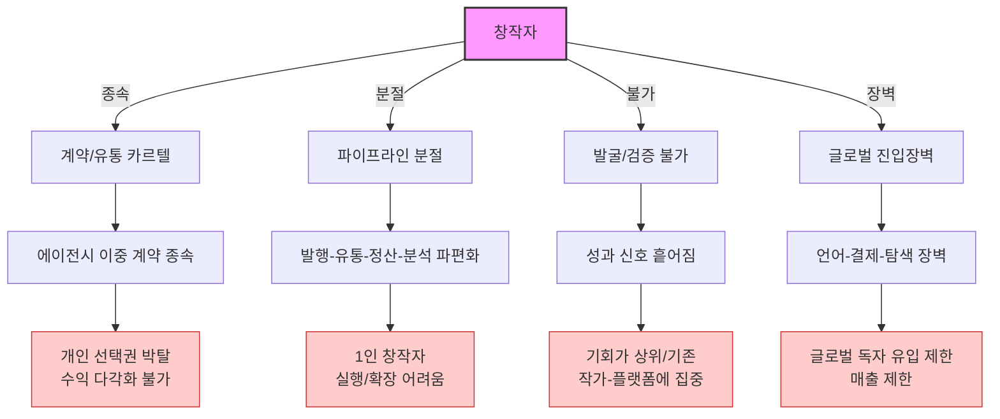
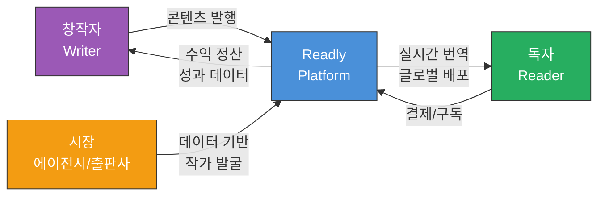
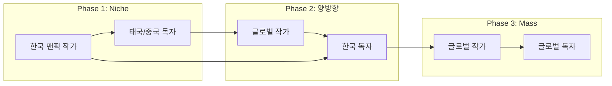
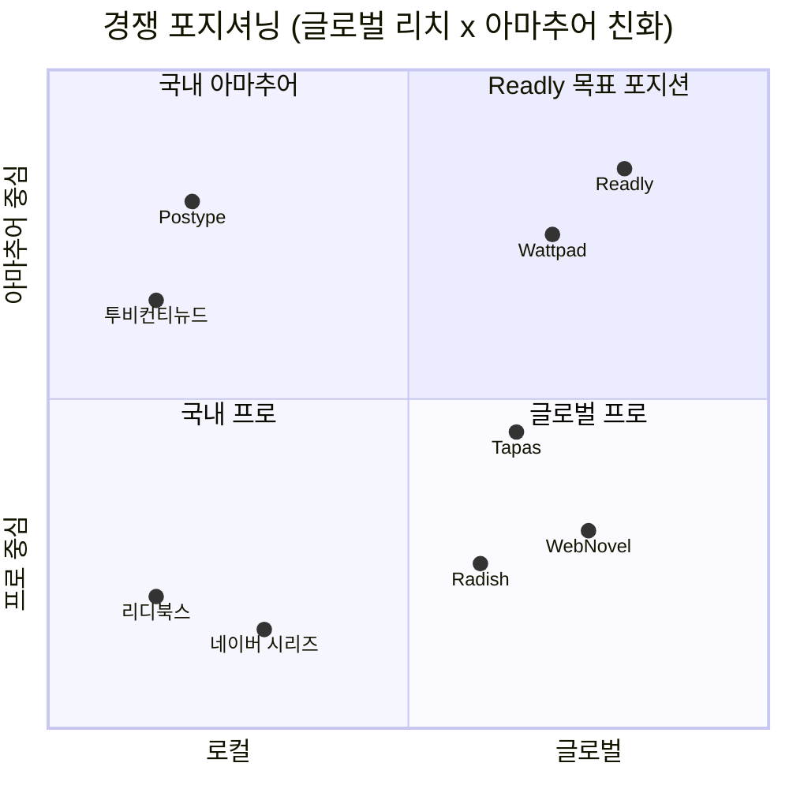
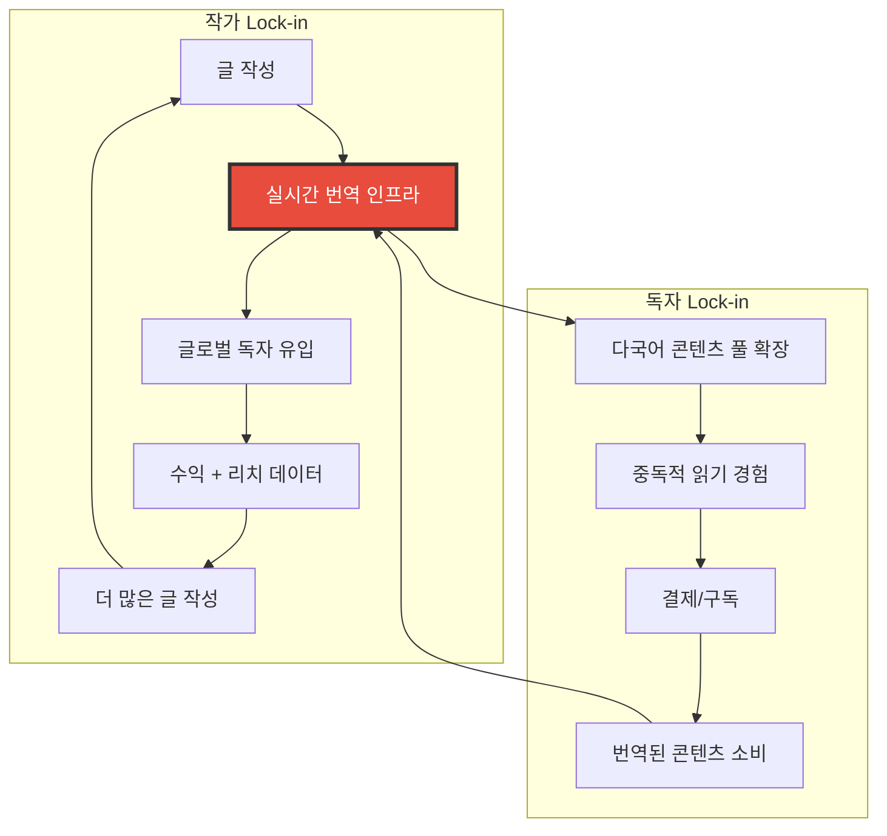
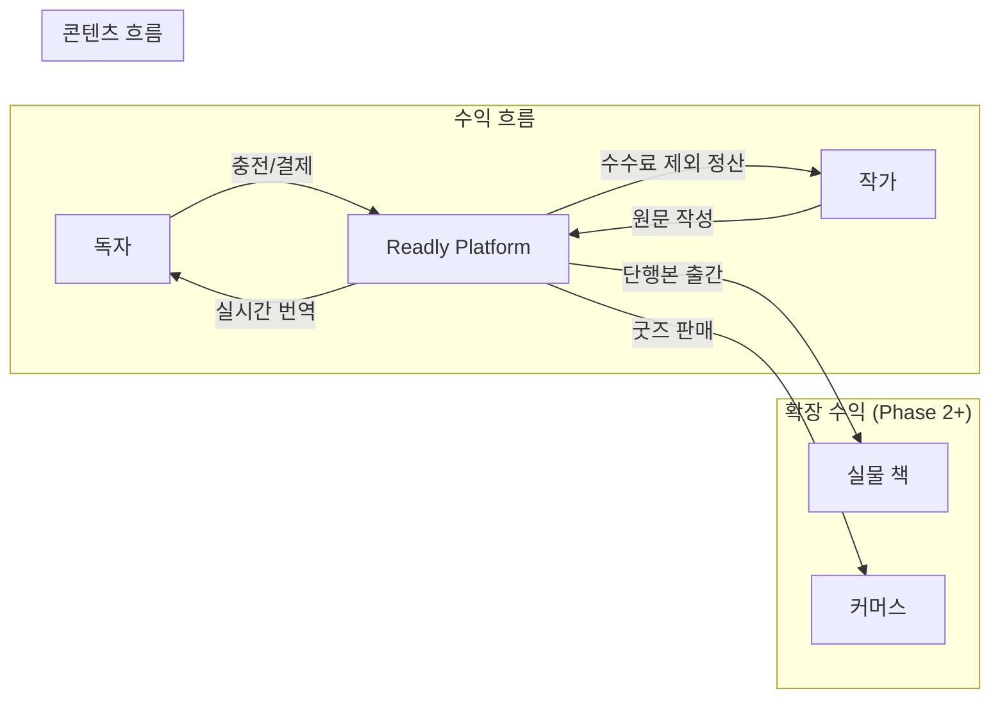
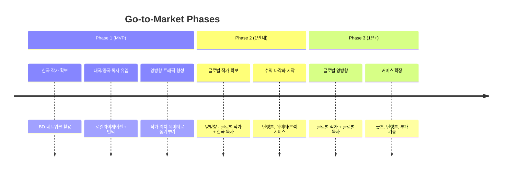
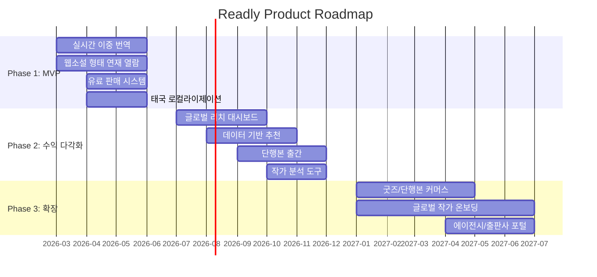

# Readly Product Brief

> **문서 유형**: Product Brief (Innovation Strategy 프레임워크)
> **작성일**: 2026-02-25
> **상태**: Draft
> **목적**: PRD 작성 시 참조하는 제품 전략 기초 문서
> **관련 문서**: `PM-DOCS/Planning/`, `.claude/context/business/`

---

## 목차

1. [Vision & Mission](#1-vision--mission)
2. [Problem Statement](#2-problem-statement)
3. [Target Users](#3-target-users)
4. [Niche Market Focus](#4-niche-market-focus)
5. [Competitive Landscape](#5-competitive-landscape)
6. [Value Proposition & Lock-in](#6-value-proposition--lock-in)
7. [Business Model](#7-business-model)
8. [Go-to-Market Strategy](#8-go-to-market-strategy)
9. [Roadmap](#9-roadmap)
10. [Legal Risks](#10-legal-risks)

---

## 1. Vision & Mission

### Vision

> 1인 창작자의 풀퍼널 글로벌 유통 및 수익 다각화를 돕는 플랫폼

### Mission

계약에 묶이지 않고, **한 편부터 '번역-발행-판매-정산-데이터'를 한 번에 실행**할 수 있는 통합 인프라를 제공한다.

### 핵심 가치 정의

| 가치                 | 한 줄 정의                                                       |
| -------------------- | ---------------------------------------------------------------- |
| **창작자 자율성**    | 계약 종속 없이 발행-판매-해외 수출-정산-분석-고도화까지 1인 실행 |
| **글로벌 리치**      | 한 번 쓰면 N개 언어로 번역-발행-판매 원스톱                      |
| **데이터 기반 발굴** | 흩어진 성과 신호를 모아 "좋은 글"의 발굴 비용 절감               |
| **독자 접근성**      | 언어장벽 없이 전세계 콘텐츠를 실시간 번역으로 소비               |

---

## 2. Problem Statement

### 시장 배경: 성장하지만, 창작자에게 돈/기회가 전달되지 않는 구조

| 지표                  | 수치             | 의미                                  |
| --------------------- | ---------------- | ------------------------------------- |
| 국내 창작자 평균 보수 | **1,055만원/年** | 전업 생존 불가 수준                   |
| 투잡 비율             | **47.5%**        | 절반이 창작만으로 생계 유지 불가      |
| 창작 활동 이탈/단절률 | **23%**          | 4명 중 1명이 이탈, 동일 시나리오 반복 |
| 한국 IP 해외 수요     | **증가 추세**    | 유통 방식 한계로 접근성 부족          |

### 구조적 병목 분석



| 병목                 | 현재 상태                                   | 결과                                |
| -------------------- | ------------------------------------------- | ----------------------------------- |
| **계약/유통 카르텔** | 에이전시 이중 계약 종속 불가피              | 개인 선택권 박탈, 수익 다각화 불가  |
| **파이프라인 분절**  | 발행-유통-정산-분석 파편화                  | 1인 창작자 실행/확장 어려움         |
| **발굴/검증 불가**   | 성과 신호가 흩어져 "좋은 글" 발굴 비용 증가 | 기회가 상위/기존 작가-플랫폼에 집중 |
| **글로벌 진입장벽**  | 언어-결제-탐색 장벽                         | 글로벌 독자 유입 제한, 매출 제한    |

### 결론

> 창작자가 계약에 묶이지 않고, 한 편부터 **번역-발행-판매-정산-데이터**를 한 번에 실행할 수 있는 통합 인프라가 필요하다.

---

## 3. Target Users

### 3.1 창작자 (Writer)

**프로필**: 플랫폼/에이전시 계약 없이 콘텐츠를 쉽게 발행하고 다각도로 수익화하고 싶은 아마추어 작가

| 속성           | 상세                                                             |
| -------------- | ---------------------------------------------------------------- |
| **핵심 니즈**  | 계약 종속 없이 발행-판매-해외 수출-정산-분석-고도화까지 1인 실행 |
| **현재 행동**  | 포스타입, 개인 블로그, SNS 등 파편화된 채널에서 활동             |
| **Pain Point** | 글로벌 독자 접근 불가, 수익화 경로 제한, 데이터/분석 부재        |
| **기대 가치**  | 취미 활동의 수익화 + 글로벌 독자에게 읽히는 경험                 |

### 3.2 독자 (Reader)

**프로필**: 언어장벽 없이 원하는 작품을 다양하게 보고 싶은 사람

| 속성           | 상세                                                            |
| -------------- | --------------------------------------------------------------- |
| **핵심 니즈**  | 실시간 다국어로 더 많은 작품을 쉽게 탐색-결제-소비              |
| **현재 행동**  | ChatGPT/DeepL로 수동 번역, 구글링으로 파편화된 연재처 탐색      |
| **Pain Point** | 글 잘쓰는 아마추어 찾기 어려움, 연재처 파편화, 번역 품질 불균일 |
| **기대 가치**  | 양질의 콘텐츠를 자연스러운 번역으로 중독적 읽기 경험            |

### 3.3 시장 (에이전시/출판사)

**프로필**: 인기 많고 작품성 좋은 작품/작가를 섭외하고 싶은 곳

| 속성           | 상세                                |
| -------------- | ----------------------------------- |
| **핵심 니즈**  | 데이터 기반 작품/작가 발굴 및 검증  |
| **현재 행동**  | 수동 스카우팅, 구전/소문 기반 섭외  |
| **Pain Point** | 발굴/검증 불가로 기회 불균형 발생   |
| **기대 가치**  | 성과 데이터를 통한 효율적 작가 발굴 |

### 사용자 관계 다이어그램



---

## 4. Niche Market Focus

### 타겟 시장: 팬픽션(Fanfiction)

대표적인 아마추어 음지 시장으로, **콘텐츠가 항상 부족**한 특성을 가진다.

| 항목              | 상세                                         |
| ----------------- | -------------------------------------------- |
| **콘텐츠 유형**   | 드라마/연예인 대상 2차 창작물                |
| **핵심 장르**     | BL/GL (대외적 노출은 제한적이나 실질적 타겟) |
| **1차 타겟 지역** | 태국, 중국                                   |
| **2차 확장 지역** | 글로벌 전역                                  |

### 팬픽션 시장의 특수성

| 특성              | 설명                                     | 전략적 의미                           |
| ----------------- | ---------------------------------------- | ------------------------------------- |
| **인물 고정**     | 특정 연예인을 주인공으로 고정            | 커플링/인물 기반 탐색 시스템 필요     |
| **리얼리티 지향** | 모델의 성격/성향을 사실적으로 반영       | 작가의 몰입도와 독자 만족도 정비례    |
| **시한부 콘텐츠** | 콘텐츠 수명 = 연예인 인기에 정비례       | 트렌드 기반 큐레이션/추천 중요        |
| **아마추어 독점** | 프로 작가는 공식적으로 팬픽 안 씀        | 아마추어 작가 지원 시스템이 핵심      |
| **GL 시장 갈증**  | GL 시장은 BL 대비 규모가 압도적으로 작음 | 양질의 GL 콘텐츠 확보가 강력한 차별화 |

### 독자 Pain Point 분석

```
1. 글 잘쓰는 아마추어 찾기 힘듦
   → 발굴/추천 시스템으로 해소

2. 아마추어라 연재처가 파편화 → 구글링 필요
   → 플랫폼 통합으로 원스톱 접근

3. 커플링 인기 하락 → 콘텐츠 생산 감소 → 즐길거리 감소 악순환
   → 글로벌 독자 유입으로 작가 동기부여 유지
   → 다국어 콘텐츠 풀 확장으로 선택지 확대
```

### 시장 진입 전략: Niche-to-Mass



---

## 5. Competitive Landscape

### 직접 경쟁사 비교

| 서비스                | 타겟           | 수익 모델      | 글로벌   | 번역            | 아마추어 지원 |
| --------------------- | -------------- | -------------- | -------- | --------------- | ------------- |
| **WebNovel**          | 프로/프로 지향 | 유료 챕터      | O        | 수동/부분       | 낮음          |
| **Radish Fiction**    | 프로/프로 지향 | 유료 챕터      | O        | 수동            | 낮음          |
| **Tapas**             | 프로/프로 지향 | 광고+유료      | O        | 수동            | 중간          |
| **Wattpad**           | 아마추어 중심  | 광고+유료      | O        | 수동            | 높음          |
| **리디북스**          | 프로           | 유료 판매      | X        | X               | 낮음          |
| **네이버 시리즈**     | 프로           | 유료 챕터      | O (부분) | 수동            | 낮음          |
| **포스타입(Postype)** | 아마추어 중심  | 유료 구독      | X        | X               | 높음          |
| **투비컨티뉴드**      | 아마추어 중심  | 유료 구독      | X        | X               | 중간          |
| **Readly**            | 아마추어 중심  | 유료 구독+구매 | **O**    | **실시간 자동** | **높음**      |

### PMF 검증 근거: 포스타입(Postype)

포스타입은 한국에서 팬픽 유료화 모델을 이미 검증한 서비스이다.

- **형태**: 블로그 형태이지만 실질적으로 팬픽/아마추어 소설/웹툰 플랫폼
- **수익 모델**: 작가가 직접 가격 설정, 구독/개별 구매 혼합
- **PMF 근거**: 아마추어 창작자가 유료 콘텐츠로 수익화할 수 있음을 증명

### Readly vs 포스타입 차별점

| 차별화 축            | 포스타입  | Readly                            |
| -------------------- | --------- | --------------------------------- |
| **번역**             | 미지원    | 실시간 이중 번역 시스템           |
| **글로벌 독자**      | 한국 한정 | 태국/중국 1차, 이후 글로벌        |
| **로컬라이제이션**   | 한국어만  | 회원가입-결제까지 로컬라이제이션  |
| **독자 Integration** | 없음      | 해외 독자 전용 Integration 시스템 |
| **데이터/분석**      | 기본 통계 | 글로벌 리치 대시보드              |

### 경쟁 포지셔닝 맵



---

## 6. Value Proposition & Lock-in

### 작가 핵심 가치: "Write Once, Reach Global"

| 기능                     | 설명                                                 | 작가에게의 의미                       |
| ------------------------ | ---------------------------------------------------- | ------------------------------------- |
| **자동 다국어 발행**     | 한 번 쓰면 N개 언어로 번역-발행-판매                 | "내가 번역을 신경쓸 필요 없다"        |
| **글로벌 리치 대시보드** | 내 글이 어느 나라에서 몇 명에게 읽히는지 실시간 확인 | "태국에서 340명이 내 글을 읽었습니다" |
| **계약 종속 없음**       | 플랫폼에 종속되지 않는 자유 발행                     | "내 작품의 권리는 내가 가진다"        |
| **취미의 수익화**        | 아마추어 활동에서 실질 수익 창출                     | "좋아하는 일로 돈을 벌 수 있다"       |

**핵심 동기부여 포인트**: "태국에서 340명이 당신의 글을 읽었습니다" -- 아마추어 작가에게 글로벌 독자에게 읽히는 경험은 가장 강력한 동기부여이다.

### 독자 핵심 가치: "Read Global, No Barrier"

| 기능                 | 설명                                       | 독자에게의 의미               |
| -------------------- | ------------------------------------------ | ----------------------------- |
| **실시간 번역 읽기** | ChatGPT 없이 자연스러운 번역으로 바로 읽기 | "번역기 돌리지 않아도 된다"   |
| **이중 리더**        | 원문+번역을 나란히/토글로 열람 가능        | "원문도 보면서 읽을 수 있다"  |
| **양질의 큐레이션**  | 글 잘쓰는 아마추어 작가 발굴 및 추천       | "좋은 글을 쉽게 찾을 수 있다" |
| **통합 접근**        | 파편화된 연재처를 한 곳에서                | "구글링 안 해도 된다"         |

### 기술 코어: 실시간 번역 인프라

실시간 번역 인프라는 양쪽(작가/독자) Lock-in의 기반 기술이다.



---

## 7. Business Model

### 수익 구조

| 수익원          | 설명                                   | 시기     | 우선순위 |
| --------------- | -------------------------------------- | -------- | -------- |
| **작가 수수료** | 콘텐츠 거래 시 플랫폼 수수료           | MVP      | 핵심     |
| **독자 충전**   | 플랫폼에 금액 미리 충전 후 콘텐츠 구매 | MVP      | 핵심     |
| **번역 판매**   | 다양한 언어 번역 버전 구매             | MVP      | 핵심     |
| **단행본 출간** | 인기 작가의 커스텀 단행본 발행         | Phase 2+ | 확장     |
| **커머스**      | 굿즈, 단행본 구매                      | Phase 3+ | 장기     |
| **부가 기능**   | 앱 내 추가 부가 기능 구매              | Phase 3+ | 장기     |

### 가치 흐름



---

## 8. Go-to-Market Strategy

### Cold Start 전략

**핵심 자산**: BD 매니저의 작가 네트워크

| 단계 | 액션                                | 기대 효과                      |
| ---- | ----------------------------------- | ------------------------------ |
| 1    | BD 매니저 네트워크로 초기 작가 확보 | 핵심 콘텐츠 공급원 확보        |
| 2    | 해당 작가의 기존 팬 가입 유도       | 초기 독자 풀 형성              |
| 3    | 글로벌 독자 유입 (번역 콘텐츠)      | 작가에게 글로벌 리치 경험 제공 |
| 4    | 작가 입소문 확산                    | 유기적 성장 시작               |

### 마케팅 메시지

**작가 대상**: "글로벌 유저들에게 내 글을 소개하세요" + 수익화 가능성 제시

**독자 대상**: "한국의 양질의 팬픽을, 당신의 언어로 바로 읽으세요"

### Phase별 확장 전략



---

## 9. Roadmap

### Phase 1: MVP -- 글로벌 작품의 열람과 판매 경계를 허무는 것이 최우선

| 기능                      | 설명                             | 핵심 가치          |
| ------------------------- | -------------------------------- | ------------------ |
| **실시간 이중 번역**      | 원문-번역 동시 제공, 이중 리더   | 언어 장벽 제거     |
| **웹소설 형태 연재 열람** | 블로그 연재를 전자책 형태로 열람 | 중독적 읽기 경험   |
| **유료 판매**             | 작가가 가격 설정, 독자가 구매    | 수익화 시작        |
| **로컬라이제이션**        | 태국 독자 대상 회원가입-결제     | 1차 해외 시장 진입 |

**MVP 성공 기준**: 작가와 독자가 글로벌 작품의 열람과 판매 경계를 허무는 경험을 하는 것

### Phase 2: 수익 다각화 + 데이터/분석

| 기능                 | 설명                                     |
| -------------------- | ---------------------------------------- |
| 글로벌 리치 대시보드 | 국가별 독자 수, 수익, 트렌드 실시간 확인 |
| 데이터 기반 추천     | 성과 데이터 기반 작품/작가 추천          |
| 단행본 출간          | 인기 작가 커스텀 단행본 발행             |
| 작가 분석 도구       | 독자 행동 분석, 연재 최적화 인사이트     |

### Phase 3: 커머스 + 글로벌 작가 확장

| 기능                 | 설명                         |
| -------------------- | ---------------------------- |
| 굿즈/단행본 커머스   | 플랫폼 내 물리적 상품 판매   |
| 글로벌 작가 온보딩   | 한국 외 작가 유입 (양방향)   |
| 부가 기능 판매       | 앱 내 프리미엄 기능          |
| 에이전시/출판사 포털 | 데이터 기반 작가 발굴 서비스 |

### Roadmap Overview



---

## 10. Legal Risks

### 미검토 사항

| 리스크        | 상세                                             | 영향도 | 상태   |
| ------------- | ------------------------------------------------ | ------ | ------ |
| **초상권**    | 실제 연예인 기반 팬픽션의 초상권 문제            | 높음   | 미검토 |
| **저작권**    | 2차 창작물 수익화의 저작권 이슈                  | 높음   | 미검토 |
| **개인정보**  | 글로벌 서비스의 GDPR/PDPA 등 각국 개인정보보호법 | 중간   | 미검토 |
| **결제/정산** | 해외 결제 라이선스, 외환 규정                    | 중간   | 미검토 |

### 권고 사항

1. MVP 출시 전 초상권/저작권에 대한 법적 검토 반드시 선행
2. 팬픽션 수익화에 대한 면책 조항 및 이용약관 설계
3. 1차 타겟 지역(태국, 중국)의 현지 법률 검토
4. 글로벌 서비스 확장 시 각국 개인정보보호법 컴플라이언스 계획 수립

---

## 부록: PRD 작성 시 참조 가이드

이 Product Brief를 기반으로 PRD를 작성할 때 각 섹션이 어떻게 매핑되는지 정리한다.

| Product Brief 섹션 | PRD 매핑                                         |
| ------------------ | ------------------------------------------------ |
| Vision & Mission   | PRD 1. 개요 - 배경 및 목적                       |
| Problem Statement  | PRD 2. 목표 & 성공 지표 - 비즈니스 목표 근거     |
| Target Users       | PRD 3. 유저스토리 - 역할 정의                    |
| Niche Market Focus | PRD 2. 목표 & 성공 지표 - 시장 컨텍스트          |
| Value Proposition  | PRD 3. 유저스토리 - 가치 정의                    |
| Business Model     | PRD 10. 우선순위 & 스코프 - 비즈니스 임팩트 근거 |
| Go-to-Market       | PRD 10. 우선순위 & 스코프 - Phase 정의 근거      |
| Roadmap            | PRD 10. 우선순위 & 스코프 - MVP vs 후속          |
| Legal Risks        | PRD 9. 엣지 케이스 & 에러 처리 - 법적 제약       |
