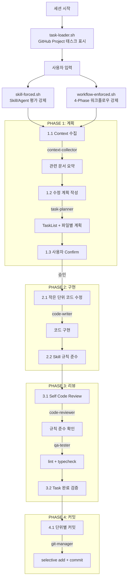

# Readly 프로젝트 구조 및 워크플로우 분석 보고서

> 분석일: 2026-02-13
> 대상: `.claude/`, `.github/` 디렉토리 전체 구조

---

## 1. 현재 구조 요약표

### 1-1. Hooks (3개)

| 컴포넌트명             | 타입 | 트리거 조건        | 주요 기능                          | 입력                                       | 출력                             | 의존성                |
| ---------------------- | ---- | ------------------ | ---------------------------------- | ------------------------------------------ | -------------------------------- | --------------------- |
| `task-loader.sh`       | hook | `SessionStart`     | GitHub Project #4 태스크 요약 표시 | gh CLI 쿼리                                | Priority별 태스크 테이블         | `gh` CLI, GitHub 인증 |
| `skill-forced.sh`      | hook | `UserPromptSubmit` | Skill/Agent 평가 프로토콜 강제     | `.claude/skills/`, `.claude/context/` 스캔 | 평가 체크리스트 프롬프트         | Skill YAML 파싱       |
| `workflow-enforced.sh` | hook | `UserPromptSubmit` | 4-Phase 워크플로우 순서 강제       | `.claude/skills/` 스캔                     | Plan→Impl→Review→Commit 프로토콜 | Skill YAML 파싱       |

### 1-2. Agents (15개)

| 컴포넌트명             | 모델   | 주요 기능                           | 트리거 조건                                 | 의존성                                |
| ---------------------- | ------ | ----------------------------------- | ------------------------------------------- | ------------------------------------- |
| `explore`              | haiku  | 파일/코드 빠른 검색                 | 파일 위치 탐색 필요 시                      | Glob, Grep                            |
| `context-collector`    | sonnet | 배경 정보 수집·요약                 | 복잡한 작업 시작 전                         | `.claude/context/`, `.claude/skills/` |
| `task-planner`         | opus   | 요구사항 명확화 + TaskList 생성     | 복잡한 계획 수립 시                         | context-collector 결과 참조           |
| `impact-analyzer`      | opus   | 코드 변경 영향 범위·위험도 평가     | 코드 수정 전                                | context-collector 결과 참조           |
| `architect`            | opus   | 시스템 구조 설계·디버깅             | 새 모듈/아키텍처 설계 시                    | context 문서                          |
| `designer`             | sonnet | UI/UX 컴포넌트 설계·스타일링        | UI 작업 시                                  | frontend Skill                        |
| `code-writer`          | opus   | 3개+ 파일 코드 구현                 | task-planner 계획 후                        | 모든 Skill 규칙                       |
| `code-reviewer`        | opus   | 코드 품질 검토·린트 실행            | 구현 완료 후                                | Skill 체크리스트                      |
| `qa-tester`            | sonnet | 빌드·린트·타입체크 검증             | 리뷰 완료 후                                | `yarn lint`, `yarn typecheck`         |
| `git-manager`          | sonnet | 커밋·PR·브랜치 관리                 | 모든 Git 작업 시 (**Main Agent 직접 금지**) | Git Skill                             |
| `git`                  | sonnet | 순수 Git 명령어 실행                | 비-워크플로우 Git 작업                      | -                                     |
| `project-task-manager` | sonnet | GitHub Project 태스크 CRUD          | 태스크 관리 시                              | `gh` CLI, Project ID                  |
| `context-manager`      | sonnet | `.claude/context/` 파일 구조 최적화 | 문서 비대화 시                              | context 파일                          |
| `context-generator`    | opus   | PR diff → Context 문서 자동 생성    | **CI 전용** (GitHub Actions)                | ContextGeneration Skill               |
| `director`             | opus   | 스펙 논리적 정합성 검증·충돌 탐지   | 스펙 변경 시                                | context 전체 문서                     |

### 1-3. Skills (19개 = 11 메인 + 8 서브파일)

| 스킬명             | 파일                         | 토큰  | 핵심 규칙                                                                |
| ------------------ | ---------------------------- | ----- | ------------------------------------------------------------------------ |
| API-Development    | `api/SKILL.md`               | ~500  | tRPC Router → MicroserviceClient → NestJS → Service → RepositoryProvider |
| Repository-Pattern | `api/repository.md`          | ~600  | RepositoryProvider 필수, find 우선, findOrFail+catch 패턴                |
| Transaction        | `api/transaction.md`         | ~400  | @Transactional 모든 Mutation 필수 (Master-Slave 정합성)                  |
| DDD-Pattern        | `api/ddd.md`                 | ~700  | Entity = 비즈니스 로직, Service = 오케스트레이션                         |
| Frontend           | `frontend/SKILL.md`          | ~1000 | TanStack Router, react-hook-form+Zod, tailwind-styled-components         |
| Backend            | `Backend/SKILL.md`           | ~400  | 레이어별 객체 변환, find 우선 queryBuilder                               |
| Coding             | `Coding/SKILL.md`            | ~500  | SRP, then-catch 선호, 삼항 2+파라미터 금지                               |
| Common             | `common/SKILL.md`            | ~400  | 네이밍 컨벤션, Git 규칙, 에러 처리                                       |
| React              | `React/SKILL.md`             | ~600  | 컴포넌트 분류, 훅 규칙, 메모이제이션                                     |
| Git                | `Git/SKILL.md`               | ~100  | 커밋/PR 인덱스 (git.md, pr-review.md, pr-apply.md)                       |
| Documentation      | `Documentation/SKILL.md`     | ~800  | frontmatter, Context/Skill 템플릿                                        |
| docs               | `docs/SKILL.md`              | ~400  | Context/Skill 파일 구조                                                  |
| Director           | `Director/SKILL.md`          | ~600  | 스펙 문서 구조·검증 규칙                                                 |
| ContextGeneration  | `ContextGeneration/SKILL.md` | ~800  | PR diff → codebase/business 문서 생성 규칙                               |
| Task-Management    | `task-management/SKILL.md`   | ~600  | gh CLI, Priority/Status ID, 관리 원칙                                    |

### 1-4. GitHub Actions (4개)

| Workflow                 | 트리거                                   | 기능                      | Claude 연동                                           |
| ------------------------ | ---------------------------------------- | ------------------------- | ----------------------------------------------------- |
| `claude-code-review.yml` | PR open/sync/reopen                      | 자동 코드 리뷰            | `code-review` 플러그인                                |
| `claude.yml`             | `@claude` 멘션 (이슈/PR 코멘트)          | 대화형 Claude 에이전트    | `.claude/agents/` 전체                                |
| `context-gen.yml`        | PR open/sync (`.claude/context/**` 제외) | Context 문서 자동 생성    | `context-generator` agent + `ContextGeneration` Skill |
| `labeler.yml`            | PR target                                | 브랜치명 기반 자동 라벨링 | 없음 (순수 GitHub Action)                             |

### 1-5. GitHub 설정

| 파일                                        | 기능                                                                             |
| ------------------------------------------- | -------------------------------------------------------------------------------- |
| `.github/labeler.yml`                       | feat→Feature, fix→BugFix, docs→Documentation, style→Design, refactor→Refactoring |
| `.github/auto_assign.yml`                   | PR 자동 리뷰어 할당: @0r0loo, @qurugi0347                                        |
| `.github/CODEOWNERS`                        | 전체 코드 오너: @0r0loo, @qurugi0347                                             |
| `.github/pull_request_template.md`          | PR 설명/목표/변경사항 템플릿                                                     |
| `.github/ISSUE_TEMPLATE/bug_report.md`      | `[BUG]` 이슈 템플릿                                                              |
| `.github/ISSUE_TEMPLATE/feature_request.md` | `[FEATURE]` 이슈 템플릿                                                          |

---

## 2. 워크플로우 다이어그램 (Mermaid)

### 2-1. 전체 시스템 아키텍처

```mermaid
graph TD
    subgraph "GitHub Events"
        GH_PR[PR 생성/업데이트]
        GH_COMMENT[@claude 멘션]
        GH_ISSUE[이슈 생성]
    end

    subgraph "GitHub Actions"
        WF_REVIEW[claude-code-review.yml]
        WF_CLAUDE[claude.yml]
        WF_CONTEXT[context-gen.yml]
        WF_LABEL[labeler.yml]
    end

    subgraph "Claude Code CLI - 로컬"
        HOOK_SESSION[hook: task-loader.sh<br/>SessionStart]
        HOOK_SKILL[hook: skill-forced.sh<br/>UserPromptSubmit]
        HOOK_WORKFLOW[hook: workflow-enforced.sh<br/>UserPromptSubmit]
        MAIN[Main Agent]
    end

    subgraph "Subagents"
        SA_EXPLORE[explore<br/>haiku]
        SA_CONTEXT[context-collector<br/>sonnet]
        SA_PLANNER[task-planner<br/>opus]
        SA_IMPACT[impact-analyzer<br/>opus]
        SA_ARCH[architect<br/>opus]
        SA_DESIGN[designer<br/>sonnet]
        SA_CODE[code-writer<br/>opus]
        SA_REVIEW[code-reviewer<br/>opus]
        SA_QA[qa-tester<br/>sonnet]
        SA_GIT[git-manager<br/>sonnet]
        SA_TASK[project-task-manager<br/>sonnet]
        SA_CTXMGR[context-manager<br/>sonnet]
        SA_DIR[director<br/>opus]
    end

    subgraph "Data Stores"
        GH_PROJECT[GitHub Project #4<br/>overdunenet]
        CTX_DOCS[.claude/context/]
        SKILLS[.claude/skills/]
        CODEBASE[apps/ packages/]
    end

    GH_PR --> WF_REVIEW & WF_CONTEXT & WF_LABEL
    GH_COMMENT --> WF_CLAUDE
    GH_ISSUE --> WF_CLAUDE

    WF_CONTEXT -->|context-generator agent| CTX_DOCS

    HOOK_SESSION -->|gh project item-list| GH_PROJECT
    HOOK_SKILL -->|스캔| SKILLS & CTX_DOCS
    HOOK_WORKFLOW -->|스캔| SKILLS

    MAIN --> SA_EXPLORE & SA_CONTEXT & SA_PLANNER
    MAIN --> SA_IMPACT & SA_ARCH & SA_DESIGN
    MAIN --> SA_CODE & SA_REVIEW & SA_QA
    MAIN --> SA_GIT & SA_TASK & SA_CTXMGR & SA_DIR

    SA_EXPLORE -->|Glob/Grep| CODEBASE
    SA_CONTEXT -->|Read| CTX_DOCS & SKILLS
    SA_TASK -->|gh CLI| GH_PROJECT
    SA_GIT -->|git add/commit/push| CODEBASE
```

### 2-2. 로컬 개발 워크플로우 (4-Phase)



### 2-3. GitHub 이슈 → 태스크 → 프로젝트 보드 흐름

```mermaid
graph LR
    subgraph "이슈 생성"
        A1[GitHub Issue 생성<br/>bug_report / feature_request] --> A2[자동 라벨 할당<br/>labeler.yml]
        A2 --> A3[자동 리뷰어 할당<br/>auto_assign.yml]
    end

    subgraph "태스크 등록"
        A3 --> B1[project-task-manager<br/>gh project item-add]
        B1 --> B2[Status: Backlog<br/>Priority: P2]
    end

    subgraph "작업 진행"
        B2 --> C1[Status → Ready]
        C1 --> C2[Status → In progress]
        C2 --> C3[코드 구현<br/>4-Phase 워크플로우]
    end

    subgraph "PR & 리뷰"
        C3 --> D1[PR 생성<br/>git-manager]
        D1 --> D2[자동 코드 리뷰<br/>claude-code-review.yml]
        D2 --> D3[Context 자동 생성<br/>context-gen.yml]
        D3 --> D4[Status → In review]
    end

    subgraph "완료"
        D4 --> E1[리뷰 승인<br/>CODEOWNERS]
        E1 --> E2[머지]
        E2 --> E3[Status → Done]
    end
```



---

## 3. 확장 안전 지점 리스트

### 3-1. 추가 가능한 Hook

| Hook 위치                            | 용도                   | 안전도 | 비고                                                  |
| ------------------------------------ | ---------------------- | ------ | ----------------------------------------------------- |
| `settings.json` → `SessionStart`     | 새 `.sh` hook 추가     | 안전   | 기존 `task-loader.sh`와 독립적으로 병렬 실행          |
| `settings.json` → `UserPromptSubmit` | 새 `.sh` hook 추가     | 주의   | 기존 2개 hook과 출력 순서 경합 가능. stdout 분리 필요 |
| `settings.json` → `PreToolUse`       | 도구 호출 전 검증 hook | 안전   | 현재 미사용. 새로 추가 가능                           |
| `settings.json` → `PostToolUse`      | 도구 호출 후 로깅 hook | 안전   | 현재 미사용. 새로 추가 가능                           |
| `.github/workflows/` → 새 workflow   | 추가 자동화            | 안전   | 기존 workflow와 독립 실행                             |

### 3-2. 새 Agent가 소비할 수 있는 인터페이스

| 데이터 소스                | 접근 방식                                                  | 읽기/쓰기        | 충돌 위험                                 |
| -------------------------- | ---------------------------------------------------------- | ---------------- | ----------------------------------------- |
| GitHub Project #4 (태스크) | `gh project item-list 4 --owner overdunenet --format json` | 읽기 전용        | 없음                                      |
| `.claude/context/**`       | `Read` 도구로 직접 읽기                                    | 읽기 / 쓰기 주의 | `context-generator` (CI)와 동시 쓰기 주의 |
| `.claude/skills/**`        | `Read` 도구로 직접 읽기                                    | 읽기 전용        | 없음 (수동 업데이트만)                    |
| `git log` / `git diff`     | `Bash` 도구로 실행                                         | 읽기 전용        | 없음                                      |
| GitHub Issues/PRs          | `gh issue list`, `gh pr list`                              | 읽기 / 쓰기 주의 | 라벨/상태 변경 시 기존 자동화와 경합      |

### 3-3. 파일 기반 로그/문서 저장 시 충돌 가능성

| 경로                            | 현재 소유자                      | 충돌 위험도                                  |
| ------------------------------- | -------------------------------- | -------------------------------------------- |
| `.claude/context/codebase/`     | `context-generator` (CI)         | 중간 - CI가 자동 생성, 로컬에서 수정 시 충돌 |
| `.claude/context/business/`     | `context-generator` (CI)         | 중간 - 동일                                  |
| `.claude/context/architecture/` | 수동 관리                        | 낮음 - CI가 건드리지 않음                    |
| `.claude/skills/`               | 수동 관리                        | 낮음                                         |
| `.claude/agents/`               | 수동 관리                        | 낮음                                         |
| `docs/`                         | 미사용 (빈 디렉토리 또는 미생성) | 없음 - 완전 독립                             |
| `docs/planning/`                | 미존재                           | 없음 - 신규 생성 안전                        |

---

## 4. PM 기획 자동화 추가 시 리스크

### HIGH

| 리스크                                   | 상세                                                                                                    | 영향                          | 완화 방안                                                        |
| ---------------------------------------- | ------------------------------------------------------------------------------------------------------- | ----------------------------- | ---------------------------------------------------------------- |
| **태스크 자동 생성 ↔ 수동 생성 충돌**    | `project-task-manager` agent가 이미 수동 태스크 CRUD 담당. 자동 생성 로직 추가 시 중복 태스크 발생 가능 | GitHub Project #4에 중복 항목 | 자동 생성 전 기존 태스크 중복 검사 로직 필수. `title` 기반 dedup |
| **GitHub Issue 라벨 ↔ 자동화 라벨 충돌** | `labeler.yml`이 브랜치명 기반 라벨 할당. PM 자동화가 다른 기준으로 라벨 변경 시 덮어쓰기                | 라벨 불일치, 팀 혼란          | PM 자동화는 별도 라벨 네임스페이스 사용 (예: `plan:*`)           |

### MEDIUM

| 리스크                         | 상세                                                                                                                                       | 영향                             | 완화 방안                                                                    |
| ------------------------------ | ------------------------------------------------------------------------------------------------------------------------------------------ | -------------------------------- | ---------------------------------------------------------------------------- |
| **Context 문서 동시 쓰기**     | `context-gen.yml` (CI)이 PR마다 `.claude/context/` 자동 업데이트. PM 자동화가 같은 경로에 기획 문서 생성 시 Git 충돌                       | 머지 충돌, CI 실패               | PM 문서는 별도 경로 (`docs/planning/` 또는 `.claude/context/planning/`) 사용 |
| **마일스톤 메타데이터 동기화** | GitHub Project의 Status/Priority 필드가 하드코딩된 Option ID로 관리됨. 필드 추가/변경 시 기존 `project-task-manager` agent도 업데이트 필요 | 상태 변경 실패, 잘못된 필드 매핑 | 필드 ID를 중앙 설정 파일로 분리하여 단일 소스 관리                           |
| **Hook stdout 경합**           | `UserPromptSubmit`에 3번째 hook 추가 시 기존 2개 hook의 출력과 합쳐져 프롬프트가 과도하게 길어짐                                           | Context 낭비, 응답 품질 저하     | 새 hook은 조건부 실행 (특정 키워드 감지 시만 출력)                           |

### LOW

| 리스크                                                  | 상세                                            | 안전 이유                                          |
| ------------------------------------------------------- | ----------------------------------------------- | -------------------------------------------------- |
| **`docs/planning/` 디렉토리 신규 생성**                 | 독립 경로, 기존 자동화와 무관                   | 어떤 hook/agent/workflow도 이 경로를 참조하지 않음 |
| **새 Agent 정의 추가 (`.claude/agents/pm-planner.md`)** | 파일 추가만으로 기존 동작 영향 없음             | `skill-forced.sh`가 자동 스캔하여 평가 대상에 포함 |
| **새 Skill 추가 (`.claude/skills/planning/SKILL.md`)**  | 파일 추가만으로 기존 동작 영향 없음             | `skill-forced.sh`가 자동 스캔하여 표시             |
| **GitHub Actions 새 workflow 추가**                     | `.github/workflows/pm-automation.yml` 독립 실행 | 기존 workflow와 트리거 조건이 겹치지 않으면 안전   |
| **`gh` CLI 읽기 전용 쿼리**                             | GitHub Project/Issues 조회                      | 읽기 전용이므로 부작용 없음                        |

---

## 5. 핵심 코드 스니펫

### 5-1. Hook: task-loader.sh (GitHub Project 쿼리)

```bash
ITEMS=$(gh project item-list 4 --owner overdunenet --format json 2>/dev/null)
echo "$ITEMS" | jq -r '
  .items
  | sort_by(
    if .priority == "P0" then 0
    elif .priority == "P1" then 1
    else 2 end
  )
  | .[] | "| \(.priority // "—") | \(.status) | \(.title) |"
'
```

### 5-2. Hook: skill-forced.sh (Agent 위임 규칙 핵심)

```bash
# Main Agent에서 직접 Git 명령어 실행 금지
# Git 작업은 반드시 Subagent 사용:
# Task(subagent_type="git-manager", prompt="현재 변경사항을 커밋해줘")
```

### 5-3. settings.json (Hook 등록 구조)

```json
{
  "hooks": {
    "SessionStart": [
      {
        "hooks": [
          { "type": "command", "command": ".claude/hooks/task-loader.sh" }
        ]
      }
    ],
    "UserPromptSubmit": [
      {
        "hooks": [
          { "type": "command", "command": ".claude/hooks/skill-forced.sh" }
        ]
      },
      {
        "hooks": [
          { "type": "command", "command": ".claude/hooks/workflow-enforced.sh" }
        ]
      }
    ]
  }
}
```

### 5-4. GitHub Action: context-gen.yml (핵심 부분)

```yaml
- name: Generate context documents
  uses: anthropics/claude-code-action@v1
  with:
    claude_code_oauth_token: ${{ secrets.CLAUDE_CODE_OAUTH_TOKEN }}
    claude_args: '--model opus --allowedTools "Bash(git:*),Read,Write,Edit,Glob,Grep"'
    prompt: |
      ${{ steps.read-skills.outputs.agent_def }}
      ${{ steps.read-skills.outputs.skill_guide }}
      PR diff를 분석하고 .claude/context/ 아래에 컨텍스트 문서를 생성/업데이트하세요.
```

### 5-5. project-task-manager (태스크 상태 변경)

```bash
gh project item-edit \
  --project-id PVT_kwDOBneqM84BOTlj \
  --id <item-id> \
  --field-id PVTSSF_lADOBneqM84BOTljzg9DAno \
  --single-select-option-id 47fc9ee4
```

> GitHub Project API는 **GraphQL** 기반이며, `gh project` CLI가 이를 래핑합니다. REST API는 사용하지 않습니다.

---

## 6. 문서화 파일 위치

| 파일                 | 경로                               | 용도                                                                            |
| -------------------- | ---------------------------------- | ------------------------------------------------------------------------------- |
| 프로젝트 루트 README | `CLAUDE.md` (루트)                 | 프로젝트 개요, 기술 스택, 폴더 구조                                             |
| 환경 설정 가이드     | `.claude/CLAUDE.md`                | 포트, 환경변수, 빌드 명령어                                                     |
| 아키텍처             | `.claude/context/architecture/`    | backend.md, frontend.md                                                         |
| 비즈니스             | `.claude/context/business/`        | overview.md, access-control.md, payment.md, seo-strategy.md                     |
| 코드베이스           | `.claude/context/codebase/`        | architecture-overview.md, post-entity.md, user-entity.md, seo-implementation.md |
| PR 템플릿            | `.github/pull_request_template.md` | PR 설명 구조                                                                    |
| 이슈 템플릿          | `.github/ISSUE_TEMPLATE/`          | bug_report.md, feature_request.md                                               |

---

## 7. PM 기획 자동화를 위한 권장 확장 전략

```
안전한 확장 포인트:
├── .claude/agents/pm-planner.md          ← 새 Agent 정의 (자동 스캔됨)
├── .claude/skills/planning/SKILL.md      ← 새 Skill 정의 (자동 스캔됨)
├── docs/planning/                        ← 기획 산출물 저장 (완전 독립)
├── .github/workflows/pm-automation.yml   ← 이슈→태스크 자동화 (독립 트리거)
└── settings.json → PreToolUse hook       ← 기획 검증 hook (미사용 슬롯)

주의 필요 포인트:
├── .claude/context/                      ← CI 자동 생성과 충돌 가능
├── GitHub Project 필드 추가              ← 기존 ID 하드코딩과 동기화 필요
└── UserPromptSubmit hook 추가            ← stdout 비대화 주의
```

---

## 8. Agent 호출 계층도

```
Main Agent (Context 보존 - 직접 작업 최소화)
├── explore (haiku)               ← 파일/코드 검색
├── context-collector (sonnet)    ← 배경 정보 수집
├── task-planner (opus)           ← 계획 수립
├── impact-analyzer (opus)        ← 영향 분석
├── architect (opus)              ← 설계 결정
├── designer (sonnet)             ← UI/UX 설계
├── code-writer (opus)            ← 코드 구현
├── code-reviewer (opus)          ← 품질 검토
├── qa-tester (sonnet)            ← 빌드/테스트 검증
├── git-manager (sonnet)          ← Git 작업 (필수 위임)
├── project-task-manager (sonnet) ← GitHub Project 관리
├── context-manager (sonnet)      ← 문서 구조 최적화
├── context-generator (opus)      ← CI 전용 문서 생성
├── director (opus)               ← 스펙 정합성 검증
└── git (sonnet)                  ← 순수 Git 명령
```

---

## 9. GitHub Project 설정 참조

| 항목              | 값                                             |
| ----------------- | ---------------------------------------------- |
| Project URL       | https://github.com/orgs/overdunenet/projects/4 |
| Project Number    | 4                                              |
| Owner             | overdunenet                                    |
| Project ID        | PVT_kwDOBneqM84BOTlj                           |
| Status Field ID   | PVTSSF_lADOBneqM84BOTljzg9DAno                 |
| Priority Field ID | PVTSSF_lADOBneqM84BOTljzg9DArc                 |

### Status Options

| Status      | Option ID | 설명         |
| ----------- | --------- | ------------ |
| Backlog     | f75ad846  | 아직 시작 전 |
| Ready       | 61e4505c  | 시작 가능    |
| In progress | 47fc9ee4  | 진행 중      |
| In review   | df73e18b  | 리뷰 중      |
| Done        | 98236657  | 완료         |

### Priority Options

| Priority | Option ID | 설명                 |
| -------- | --------- | -------------------- |
| P0       | 79628723  | 긴급 - 즉시 처리     |
| P1       | 0a877460  | 중요 - 현재 스프린트 |
| P2       | da944a9c  | 보통 - 여유 있을 때  |
